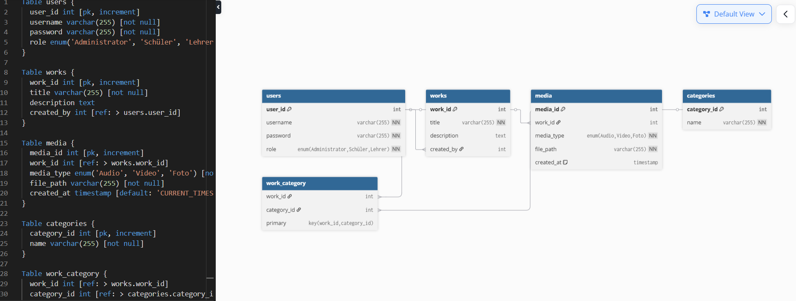
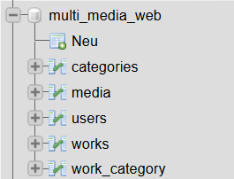

# Projekttagebuch


## Montag,07.07.2025

**Jede Woche ist von jeder/m ein Bericht über die Ergebnisse zu erstellen.**

Keine reine Beschreibung, was gemacht wurde. Festhalten der Ergebnisse inklusive:

- Quellen
- Prototypen
- Probleme, die aufgetaucht sin
- Quelltext
- **Bilder**

## Donnerstag, 18.09.2025

### Datenbank:

#### Datenbankstruktur:
- Entwurf mit: https://dbdiagram.io/d




#### Datenbank erstellen
Erste Schritte von Chat GPT erstellen lassen - Anforderungen an Chat GPT:
```
Ich möchte ein Datenbankdesign für eine relationale Datenbank machen. Verschiedene Benutzer haben verschiedene Rollen, wie zum Beispiel Administrator, Schüler oder Lehrer. Alle Benutzer können Werke anlegen. Ein Werk kann aus mehreren Medien bestehen. Die Werke lassen sich in Kategorien, wie zb Audio, Video oder Fotografie einteilen.
```

Code von Chat GPT:

```
CREATE TABLE Users (
    user_id INT PRIMARY KEY AUTO_INCREMENT,
    username VARCHAR(255) NOT NULL,
    password VARCHAR(255) NOT NULL,
    role ENUM('Administrator', 'Schüler', 'Lehrer') NOT NULL
);

CREATE TABLE Works (
    work_id INT PRIMARY KEY AUTO_INCREMENT,
    title VARCHAR(255) NOT NULL,
    description TEXT,
    created_by INT,
    FOREIGN KEY (created_by) REFERENCES Users(user_id)
);

CREATE TABLE Media (
    media_id INT PRIMARY KEY AUTO_INCREMENT,
    work_id INT,
    media_type ENUM('Audio', 'Video', 'Foto') NOT NULL,
    file_path VARCHAR(255) NOT NULL,
    created_at TIMESTAMP DEFAULT CURRENT_TIMESTAMP,
    FOREIGN KEY (work_id) REFERENCES Works(work_id)
);

CREATE TABLE Categories (
    category_id INT PRIMARY KEY AUTO_INCREMENT,
    name VARCHAR(255) NOT NULL
);

CREATE TABLE Work_Category (
    work_id INT,
    category_id INT,
    PRIMARY KEY (work_id, category_id),
    FOREIGN KEY (work_id) REFERENCES Works(work_id),
    FOREIGN KEY (category_id) REFERENCES Categories(category_id)
);
```

- Quelle: https://chatgpt.com/
#### SQL-Datenbank:




