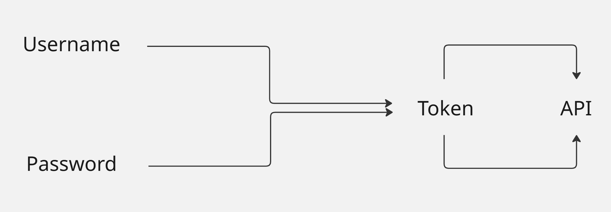

# Projekttagebuch


## Montag,07.07.2025

**Jede Woche ist von jeder/m ein Bericht über die Ergebnisse zu erstellen.**

Keine reine Beschreibung, was gemacht wurde. Festhalten der Ergebnisse inklusive:

- Quellen
- Prototypen
- Probleme, die aufgetaucht sin
- Quelltext
- **Bilder**

## Donnerstag, 18.09.2025

### ABA-Portal:
- ABA-Portal fertiggestellt und eingereicht

### Datenbank:

#### Datenbankstruktur:
- Entwurf mit: https://dbdiagram.io/d


#### Datenbank erstellen
Erste Schritte von Chat GPT erstellen lassen - Anforderungen an Chat GPT:
```
Ich möchte ein Datenbankdesign für eine relationale Datenbank machen. Verschiedene Benutzer haben verschiedene Rollen, wie zum Beispiel Administrator, Schüler oder Lehrer. Alle Benutzer können Werke anlegen. Ein Werk kann aus mehreren Medien bestehen. Die Werke lassen sich in Kategorien, wie zb Audio, Video oder Fotografie einteilen.
```

Code von Chat GPT:

```
CREATE TABLE Users (
    user_id INT PRIMARY KEY AUTO_INCREMENT,
    username VARCHAR(255) NOT NULL,
    password VARCHAR(255) NOT NULL,
    role ENUM('Administrator', 'Schüler', 'Lehrer') NOT NULL
);

CREATE TABLE Works (
    work_id INT PRIMARY KEY AUTO_INCREMENT,
    title VARCHAR(255) NOT NULL,
    description TEXT,
    created_by INT,
    FOREIGN KEY (created_by) REFERENCES Users(user_id)
);

CREATE TABLE Media (
    media_id INT PRIMARY KEY AUTO_INCREMENT,
    work_id INT,
    media_type ENUM('Audio', 'Video', 'Foto') NOT NULL,
    file_path VARCHAR(255) NOT NULL,
    created_at TIMESTAMP DEFAULT CURRENT_TIMESTAMP,
    FOREIGN KEY (work_id) REFERENCES Works(work_id)
);

CREATE TABLE Categories (
    category_id INT PRIMARY KEY AUTO_INCREMENT,
    name VARCHAR(255) NOT NULL
);

CREATE TABLE Work_Category (
    work_id INT,
    category_id INT,
    PRIMARY KEY (work_id, category_id),
    FOREIGN KEY (work_id) REFERENCES Works(work_id),
    FOREIGN KEY (category_id) REFERENCES Categories(category_id)
);
```

- Quelle: https://chatgpt.com/
#### SQL-Datenbank:


## Donnerstag, 25.09.2025

Keine reine Beschreibung, was gemacht wurde. Festhalten der Ergebnisse inklusive:

- Quellen
- Prototypen
- Probleme, die aufgetaucht sind
- Quelltext
- **Bilder**

### Fortsetzung des Udemy Kurses: API & JSON

Umgang mit API und JSON erlernen:

- API in Verwendung mit HTTPS Protpkollen (GET, POST, PATCH, DELETE, PUT)
- Beispiel: Satellitstandort erkennen mit Postman (https://www.postman.com/) und mit "Where the iss at?" (https://wheretheiss.at/w/developer)
- Beispiel: Informationen von anderen Servern holen: https://secrets-api.appbrewery.com/  &  https://bored-api.appbrewery.com/

#### Unterschied zur öffentlichen und privaten API:

(gestaltet mit Miro --> https://miro.com/app/board/uXjVJDb5gaY=/)

### AXIOS:

Mit Axios kann man besser und mit weniger Code mit eigenen Server mit API auf Daten eines anderen Servers zugreifen.
Mit Axios holt man sich die Daten, die man dann auch weiterverwenden kann. 

##### Wichtige Befehle:
 - axios.get
 - axios.delete
 - axios.request
 - axios.head
 - axios.options
 - etc.

Anwendung von AXIOS (Codeausschnitt):
- Es werden Daten von Einem Server geholt
- Falls ein Fehler auftritt oder die Daten nicht vorhanden sind wird eine Fehlermeldung ausgegeben
- (Code von Beispielübung erlernt --> Udemy)
 ```
  try {
    const response = await axios.get("https://bored-api.appbrewery.com/random");
    const result = response.data;
    res.render("index.ejs", { data: result });
  } catch (error) {
    console.error("Failed to make request:", error.message);
    res.render("index.ejs", {
      error: error.message,
    });
  }
 ```

### API Authentication:
- 0: keine Authentication --> Jeder hat zugriff darauf (unsicher)
- 1: Basic Authentication --> Login mit Username und Passwort (sicherer)
- 2: API Key Authorisation --> dem Benutzer ist es nur erlaubt, den Server mti API Key zu nutzen
- 3: Token Based Authentication --> Identitätsbestätigung & Autorisierung


(gestaltet mit Miro --> https://miro.com/app/board/uXjVJDb5gaY=/)

### JSON


#### JSON -> Javascript Datei
```
const data = JSON.parse(data);
```

#### Javascript Datei -> JSON
```
const jsonData = JSON.stringfy(data);
```

#### Übersichtlichere JSON Datei:
JSON Dateien übersichtlicher darstellen mit https://jsonviewer.stack.hu/

Beispiel: Von diesesm Code... (Code von Beispielübung -> Udemy)
```
[
  {
    "id": "0001",
    "type": "taco",
    "name": "Chicken Taco",
    "price": 2.99,
    "ingredients": {
      "protein": {
        "name": "Chicken",
        "preparation": "Grilled"
      },
      "salsa": {
        "name": "Tomato Salsa",
        "spiciness": "Medium"
      },
      "toppings": [
        {
          "name": "Lettuce",
          "quantity": "1 cup",
          "ingredients": ["Iceberg Lettuce"]
        },
        {
          "name": "Cheese",
          "quantity": "1/2 cup",
          "ingredients": ["Cheddar Cheese", "Monterey Jack Cheese"]
        },
        {
          "name": "Guacamole",
          "quantity": "2 tablespoons",
          "ingredients": ["Avocado", "Lime Juice", "Salt", "Onion", "Cilantro"]
        },
        {
          "name": "Sour Cream",
          "quantity": "2 tablespoons",
          "ingredients": ["Sour Cream"]
        }
      ]
    }
  },
  {
    "id": "0002",
    "type": "taco",
    "name": "Beef Taco",
    "price": 3.49,
    "ingredients": {
      "protein": {
        "name": "Beef",
        "preparation": "Seasoned and Grilled"
      },
      "salsa": {
        "name": "Salsa Verde",
        "spiciness": "Hot"
      },
      "toppings": [
        {
          "name": "Onions",
          "quantity": "1/4 cup",
          "ingredients": ["White Onion", "Red Onion"]
        },
        {
          "name": "Cilantro",
          "quantity": "2 tablespoons",
          "ingredients": ["Fresh Cilantro"]
        },
        {
          "name": "Queso Fresco",
          "quantity": "1/4 cup",
          "ingredients": ["Queso Fresco"]
        }
      ]
    }
  },
  {
    "id": "0003",
    "type": "taco",
    "name": "Fish Taco",
    "price": 4.99,
    "ingredients": {
      "protein": {
        "name": "Fish",
        "preparation": "Battered and Fried"
      },
      "salsa": {
        "name": "Chipotle Mayo",
        "spiciness": "Mild"
      },
      "toppings": [
        {
          "name": "Cabbage Slaw",
          "quantity": "1 cup",
          "ingredients": [
            "Shredded Cabbage",
            "Carrot",
            "Mayonnaise",
            "Lime Juice",
            "Salt"
          ]
        },
        {
          "name": "Pico de Gallo",
          "quantity": "1/2 cup",
          "ingredients": ["Tomato", "Onion", "Cilantro", "Lime Juice", "Salt"]
        },
        {
          "name": "Lime Crema",
          "quantity": "2 tablespoons",
          "ingredients": ["Sour Cream", "Lime Juice", "Salt"]
        }
      ]
    }
  }
]

```

...bekommt man diese Übersicht:


### Zusammenfassung Quellen:
- https://www.postman.com/
- https://wheretheiss.at/w/developer
- https://miro.com/app/board/uXjVJDb5gaY=/
- https://jsonviewer.stack.hu/
- https://secrets-api.appbrewery.com/ 
- https://bored-api.appbrewery.com/


