# Projekttagebuch

## Donnerstag, 18.09.2025

### ABA-Portal:
- ABA-Portal fertiggestellt und eingereicht

### Datenbank:

#### Datenbankstruktur:
- Entwurf mit: https://dbdiagram.io/d 
- Code Für Website:

```sql
Table users {
  user_id int [pk, increment]
  username varchar(255) [not null]
  password varchar(255) [not null]
  role enum('Administrator', 'Schüler', 'Lehrer') [not null]
}

Table works {
  work_id int [pk, increment]
  title varchar(255) [not null]
  description text
  created_by int [ref: > users.user_id]
}

Table media {
  media_id int [pk, increment]
  work_id int [ref: > works.work_id]
  media_type enum('Audio', 'Video', 'Foto') [not null]
  file_path varchar(255) [not null]
  created_at timestamp [default: 'CURRENT_TIMESTAMP']
}

Table categories {
  category_id int [pk, increment]
  name varchar(255) [not null]
}

Table work_category {
  work_id int [ref: > works.work_id]
  category_id int [ref: > categories.category_id]
  primary key(work_id, category_id)
}
```

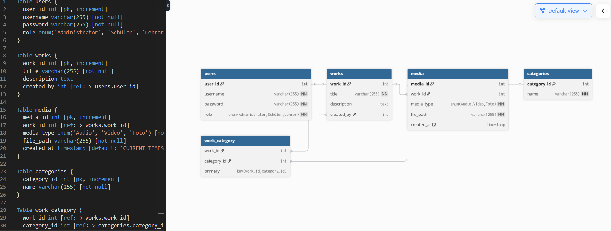


#### Datenbank erstellen
Erste Schritte von Chat GPT erstellen lassen - Anforderungen an Chat GPT:
```txt 
Ich möchte ein Datenbankdesign für eine relationale Datenbank machen. Verschiedene Benutzer haben verschiedene Rollen, wie zum Beispiel Administrator, Schüler oder Lehrer. Alle Benutzer können Werke anlegen. Ein Werk kann aus mehreren Medien bestehen. Die Werke lassen sich in Kategorien, wie zb Audio, Video oder Fotografie einteilen.
```

Code von Chat GPT: SQL Code

```sql
CREATE TABLE Users (
    user_id INT PRIMARY KEY AUTO_INCREMENT,
    username VARCHAR(255) NOT NULL,
    password VARCHAR(255) NOT NULL,
    role ENUM('Administrator', 'Schüler', 'Lehrer') NOT NULL
);

CREATE TABLE Works (
    work_id INT PRIMARY KEY AUTO_INCREMENT,
    title VARCHAR(255) NOT NULL,
    description TEXT,
    created_by INT,
    FOREIGN KEY (created_by) REFERENCES Users(user_id)
);

CREATE TABLE Media (
    media_id INT PRIMARY KEY AUTO_INCREMENT,
    work_id INT,
    media_type ENUM('Audio', 'Video', 'Foto') NOT NULL,
    file_path VARCHAR(255) NOT NULL,
    created_at TIMESTAMP DEFAULT CURRENT_TIMESTAMP,
    FOREIGN KEY (work_id) REFERENCES Works(work_id)
);

CREATE TABLE Categories (
    category_id INT PRIMARY KEY AUTO_INCREMENT,
    name VARCHAR(255) NOT NULL
);

CREATE TABLE Work_Category (
    work_id INT,
    category_id INT,
    PRIMARY KEY (work_id, category_id),
    FOREIGN KEY (work_id) REFERENCES Works(work_id),
    FOREIGN KEY (category_id) REFERENCES Categories(category_id)
);
```

- Quelle: https://chatgpt.com/
#### SQL-Datenbank:

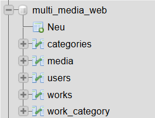


## Donnerstag, 25.09.2025

Keine reine Beschreibung, was gemacht wurde. Festhalten der Ergebnisse inklusive:

- Quellen
- Prototypen
- Probleme, die aufgetaucht sind
- Quelltext
- **Bilder**

### Fortsetzung des Udemy Kurses: API & JSON

Umgang mit API und JSON erlernen:

- API in Verwendung mit HTTPS Protpkollen (GET, POST, PATCH, DELETE, PUT)
- Beispiel: Satellitstandort erkennen mit Postman (https://www.postman.com/) und mit "Where the iss at?" (https://wheretheiss.at/w/developer)
- Beispiel: Informationen von anderen Servern holen: https://secrets-api.appbrewery.com/  &  https://bored-api.appbrewery.com/

#### Unterschied zur öffentlichen und privaten API:
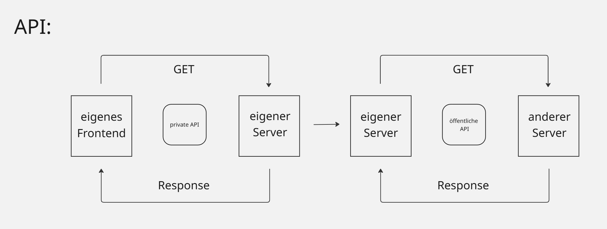
(gestaltet mit Miro --> https://miro.com/app/board/uXjVJDb5gaY=/)

### AXIOS:

Mit Axios kann man besser und in Verwendung von weniger Code mit eigenen Server mit Hilfe von API auf Daten eines anderen Servers zugreifen.
Mit Axios holt man sich die Daten, die man dann auch weiterverwenden kann. 

##### Wichtige Befehle:
 - axios.get
 - axios.delete
 - axios.request
 - axios.head
 - axios.options
 - etc.

Anwendung von AXIOS (Codeausschnitt):
- Es werden Daten von einem Server geholt
- Falls ein Fehler auftritt oder die Daten nicht vorhanden sind wird eine Fehlermeldung ausgegeben
- (Code von Beispielübung erlernt --> Udemy)

 ```javascript
  try {
    const response = await axios.get("https://bored-api.appbrewery.com/random");
    const result = response.data;
    res.render("index.ejs", { data: result });
  } catch (error) {
    console.error("Failed to make request:", error.message);
    res.render("index.ejs", {
      error: error.message,
    });
  }
 ```

### API Authentication:
- 0: keine Authentication --> Jeder hat zugriff darauf (unsicher)
- 1: Basic Authentication --> Login mit Username und Passwort (sicherer)
- 2: API Key Authorisation --> dem Benutzer ist es nur erlaubt, den Server mti API Key zu nutzen
- 3: Token Based Authentication --> Identitätsbestätigung & Autorisierung

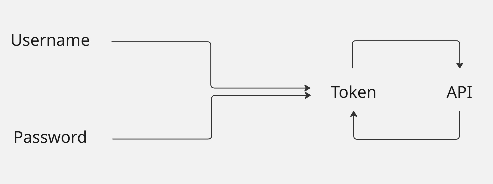
(gestaltet mit Miro --> https://miro.com/app/board/uXjVJDb5gaY=/)


### JSON
#### JSON -> Javascript Datei
```javascript
const data = JSON.parse(data);
```

#### Javascript Datei -> JSON
```javascript
const jsonData = JSON.stringfy(data);
```

#### Übersichtlichere JSON Datei:
JSON Dateien übersichtlicher darstellen mit https://jsonviewer.stack.hu/

Beispiel: Bei diesesm Code... (Code von Beispielübung -> Udemy)
```javascript
[
  {
    "id": "0001",
    "type": "taco",
    "name": "Chicken Taco",
    "price": 2.99,
    "ingredients": {
      "protein": {
        "name": "Chicken",
        "preparation": "Grilled"
      },
      "salsa": {
        "name": "Tomato Salsa",
        "spiciness": "Medium"
      },
      "toppings": [
        {
          "name": "Lettuce",
          "quantity": "1 cup",
          "ingredients": ["Iceberg Lettuce"]
        },
        {
          "name": "Cheese",
          "quantity": "1/2 cup",
          "ingredients": ["Cheddar Cheese", "Monterey Jack Cheese"]
        },
        {
          "name": "Guacamole",
          "quantity": "2 tablespoons",
          "ingredients": ["Avocado", "Lime Juice", "Salt", "Onion", "Cilantro"]
        },
        {
          "name": "Sour Cream",
          "quantity": "2 tablespoons",
          "ingredients": ["Sour Cream"]
        }
      ]
    }
  },
  {
    "id": "0002",
    "type": "taco",
    "name": "Beef Taco",
    "price": 3.49,
    "ingredients": {
      "protein": {
        "name": "Beef",
        "preparation": "Seasoned and Grilled"
      },
      "salsa": {
        "name": "Salsa Verde",
        "spiciness": "Hot"
      },
      "toppings": [
        {
          "name": "Onions",
          "quantity": "1/4 cup",
          "ingredients": ["White Onion", "Red Onion"]
        },
        {
          "name": "Cilantro",
          "quantity": "2 tablespoons",
          "ingredients": ["Fresh Cilantro"]
        },
        {
          "name": "Queso Fresco",
          "quantity": "1/4 cup",
          "ingredients": ["Queso Fresco"]
        }
      ]
    }
  },
  {
    "id": "0003",
    "type": "taco",
    "name": "Fish Taco",
    "price": 4.99,
    "ingredients": {
      "protein": {
        "name": "Fish",
        "preparation": "Battered and Fried"
      },
      "salsa": {
        "name": "Chipotle Mayo",
        "spiciness": "Mild"
      },
      "toppings": [
        {
          "name": "Cabbage Slaw",
          "quantity": "1 cup",
          "ingredients": [
            "Shredded Cabbage",
            "Carrot",
            "Mayonnaise",
            "Lime Juice",
            "Salt"
          ]
        },
        {
          "name": "Pico de Gallo",
          "quantity": "1/2 cup",
          "ingredients": ["Tomato", "Onion", "Cilantro", "Lime Juice", "Salt"]
        },
        {
          "name": "Lime Crema",
          "quantity": "2 tablespoons",
          "ingredients": ["Sour Cream", "Lime Juice", "Salt"]
        }
      ]
    }
  }
]

```

...bekommt man diese Übersicht:

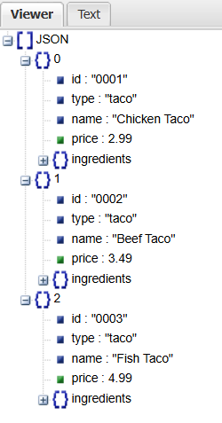

### Zusammenfassung Quellen:
- https://www.postman.com/
- https://wheretheiss.at/w/developer
- https://miro.com/app/board/uXjVJDb5gaY=/
- https://jsonviewer.stack.hu/
- https://secrets-api.appbrewery.com/ 
- https://bored-api.appbrewery.com/

## Donnerstag, 02.10.2025

### Aktualisierung der Datenbank: Gruppen/Teams hinzugefügt:
Datenbank-Übersicht mit dbdiagram.io (https://dbdiagram.io/d):
```sql
// Einfache Version für dbdiagram.io

Table users {
  user_id int [primary key]
  username varchar(255)
  password varchar(255)
  role varchar(50)
}

Table categories {
  category_id int [primary key]
  name varchar(255)
}

Table works {
  work_id int [primary key]
  title varchar(255)
  description text
  created_by int
}

Table media {
  media_id int [primary key]
  work_id int
  media_type varchar(50)
  file_path varchar(255)
  created_at datetime
}

Table work_category {
  work_id int
  category_id int
}

Table groups {
  group_id int [primary key]
  group_name varchar(255)
  description text
  category_id int
  created_by int
  created_at datetime
  max_members int
}

Table group_members {
  group_id int
  user_id int
  joined_at datetime
  is_leader bool
}

Table group_works {
  group_work_id int [primary key]
  group_id int
  work_id int
  assigned_at datetime
}

// Relationships
Ref: works.created_by > users.user_id
Ref: media.work_id > works.work_id
Ref: work_category.work_id > works.work_id
Ref: work_category.category_id > categories.category_id
Ref: groups.category_id > categories.category_id
Ref: groups.created_by > users.user_id
Ref: group_members.group_id > groups.group_id
Ref: group_members.user_id > users.user_id
Ref: group_works.group_id > groups.group_id
Ref: group_works.work_id > works.work_id
```


SQL-Code -> Gruppen werden hinzugefügt mit nötige Funktionen:
```sql
-- 6. Groups Tabelle (NEU) 
CREATE TABLE Groups (
    group_id INT PRIMARY KEY AUTO_INCREMENT,
    group_name VARCHAR(255) NOT NULL,
    description TEXT,
    category_id INT,
    created_by INT,
    created_at TIMESTAMP DEFAULT CURRENT_TIMESTAMP,
    max_members INT DEFAULT 3,
    FOREIGN KEY (category_id) REFERENCES Categories(category_id),
    FOREIGN KEY (created_by) REFERENCES Users(user_id)
);

-- 7. Group_Members Tabelle (NEU)
CREATE TABLE Group_Members (
    group_id INT,
    user_id INT,
    joined_at TIMESTAMP DEFAULT CURRENT_TIMESTAMP,
    is_leader BOOLEAN DEFAULT FALSE,
    PRIMARY KEY (group_id, user_id),
    FOREIGN KEY (group_id) REFERENCES Groups(group_id),
    FOREIGN KEY (user_id) REFERENCES Users(user_id)
);

-- 8. Group_Works Tabelle (NEU)
CREATE TABLE Group_Works (
    group_work_id INT PRIMARY KEY AUTO_INCREMENT,
    group_id INT,
    work_id INT,
    assigned_at TIMESTAMP DEFAULT CURRENT_TIMESTAMP,
    FOREIGN KEY (group_id) REFERENCES Groups(group_id),
    FOREIGN KEY (work_id) REFERENCES Works(work_id)
);
```


### Erster Versuch: die Daten der Datenbank am Frontend anzeigen lassen
Es werden alle Gruppen angezeigt, die bis jetzt in der Datenbank gespeichert wurden. Dabei werden noch zusätzlich die Mitgliederanzahl und der "Leader" des Teams angezeigt.

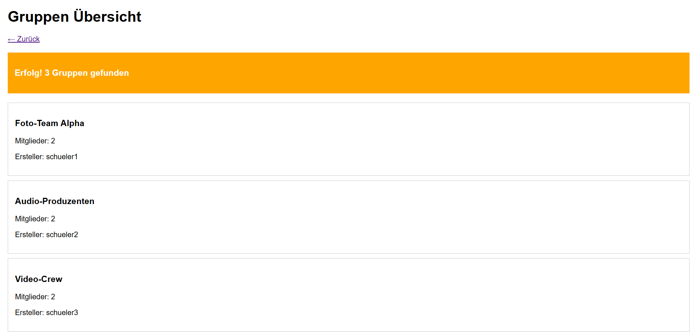

Andere Version mit Anzeige der einzelnen Teilnehmern:
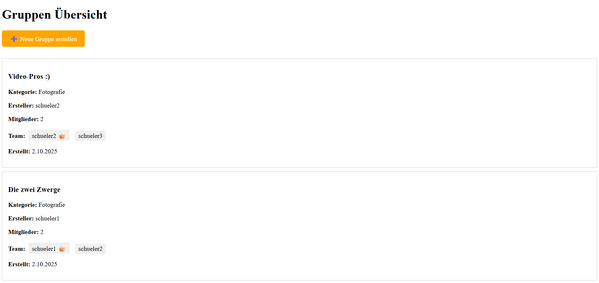


## Änderungen:

Datenbankaufbau bis jetzt zu komplex! Wir konzentrieren sich jetzt auch einen einfacheren Aufbau.
Unser Fokus liegt jetzt auf eine einzelne Datenbank die auf mehreren Schritte beruht:
- 1. Challenges
Es wird erstmal NUR möglich gemacht, dass Challenges hochgeladen werden.
- 2. Kategorien
Der zweite Schritt ist die Kategorien festzulegen, wobei die Challenges zugeordnet werden.
- 3. Workshops

Datenbankstruktur:
```sql
CREATE DATABASE multimedia_challenge;
USE multimedia_challenge;

-- Kategorien Tabelle
CREATE TABLE categories (
    id INT AUTO_INCREMENT PRIMARY KEY,
    symbol VARCHAR(50),
    name VARCHAR(100) NOT NULL UNIQUE,
    description TEXT,
    created_at TIMESTAMP DEFAULT CURRENT_TIMESTAMP,
    updated_at TIMESTAMP DEFAULT CURRENT_TIMESTAMP ON UPDATE CURRENT_TIMESTAMP
);

-- Challenges Tabelle
CREATE TABLE challenges (
    id INT AUTO_INCREMENT PRIMARY KEY,
    category_id INT NOT NULL,
    name VARCHAR(255) NOT NULL,
    description TEXT,
    example_images JSON, -- Speichert Pfade zu Beispielbildern
    created_at TIMESTAMP DEFAULT CURRENT_TIMESTAMP,
    updated_at TIMESTAMP DEFAULT CURRENT_TIMESTAMP ON UPDATE CURRENT_TIMESTAMP
);
```
Einträge:
```sql
USE multimedia_challenge;

-- Standard-Kategorien einfügen
INSERT INTO multimedia_challenge.categories (symbol, name, description, reference) VALUES
('📷', 'Foto', 'Fotografie Challenges', 'FOT-01'),
('🎥', 'Video', 'Video Production Challenges', 'VID-01'),
('⚙️', 'Metall', 'Metallbearbeitung Challenges', 'MET-01'),
('🎬', 'Animation', 'Animation und Motion Graphics', 'ANIM-01'),
('🎵', 'Audio', 'Audio Production Challenges', 'AUD-01');

-- Beispiel-Challenges einfügen
INSERT INTO multimedia_challenge.challenges (category_id, name, description, example_images) VALUES
(1, 'Porträt Fotografie', 'Erstelle ausdrucksstarke Porträtaufnahmen', '["/images/portrait1.jpg", "/images/portrait2.jpg"]'),
(1, 'Landschaftsfotografie', 'Fange die Schönheit der Natur ein', '["/images/landscape1.jpg", "/images/landscape2.jpg"]'),
(2, 'Kurzfilm Challenge', 'Erstelle einen 3-minütigen Kurzfilm', '["/videos/shortfilm1.mp4"]'),
(3, 'Metall Skulptur', 'Gestalte eine künstlerische Metallskulptur', '["/images/sculpture1.jpg"]'),
(4, '2D Animation', 'Animierte eine kurze 2D Geschichte', '["/animations/2d-sample.mp4"]'),
(5, 'Sound Design', 'Designe den Sound für eine Filmszene', '["/audio/sample1.mp3"]');
```

## Donnerstag, 09.10.2025

### Fortsetzung von der Erstellung eines Prototyps:
Admin Ansicht:
- Kategorie
- Challenge

### Erste Erfolge:

Startseite:
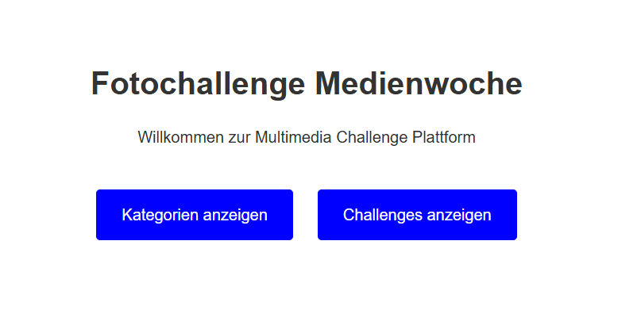

Kategorien:
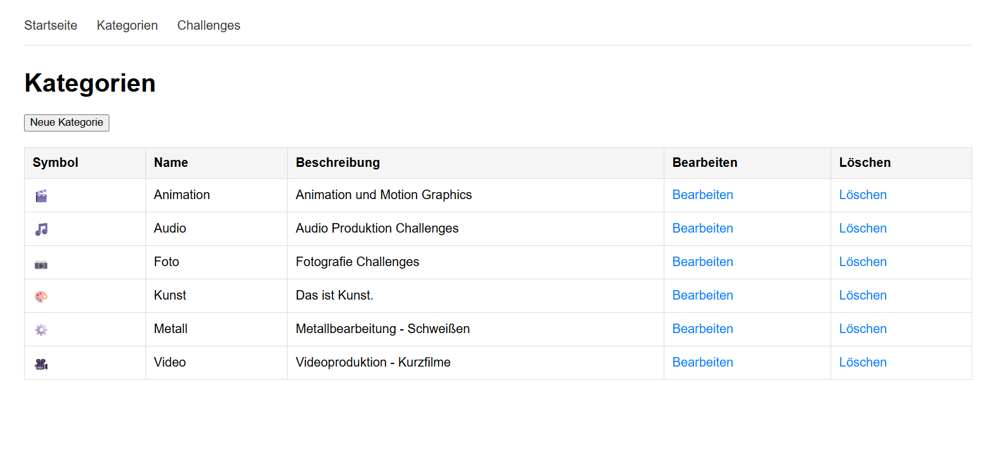

Kategorien bearbeiten:
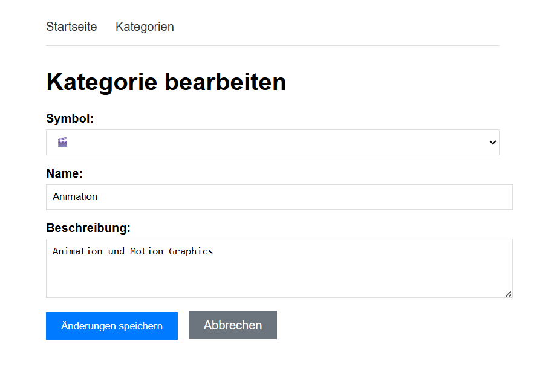

Neue Kategorie:
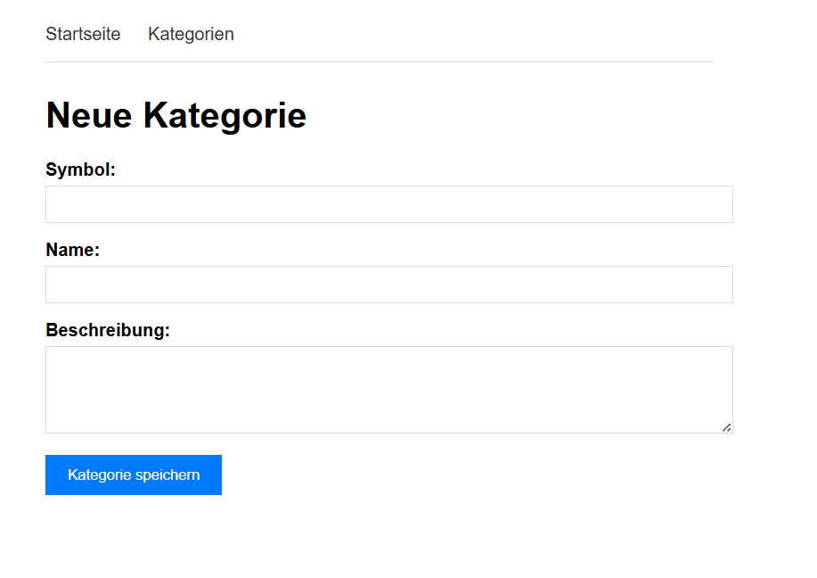

Challenges:
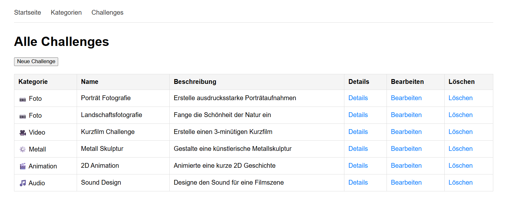

Neue Challenge:
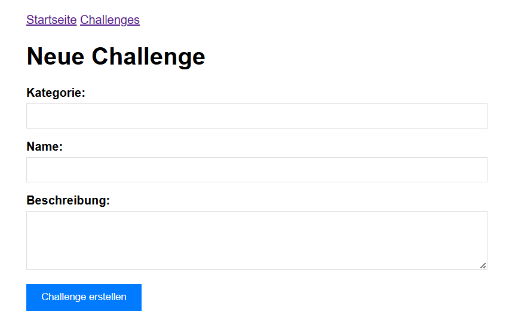

### Datenbank und Programmierung:
Durch mysql2 kann man auf die Datenbank zugreifen. Die Website läuft Local auf dem Rechner und kann per "nodemon index.js" gestartet werden. Es ist Grundlegend eine sehr einfache Website, die die Funktionen klar und deutlich darstellen soll: Kategorien und Challenges verwalten.
- Datenbank: mysql2
- Programmierung: Node.js, Express.js, etc.

### Neuer Prototyp - Erstellt von Herr Hanl
Der Prototyp, den uns Herr Hanl zur verfügung gestellt hat bringt folgende Funktionen mit sich:
- Kategorie Ansicht
- Kategorie hinzufügen
- Kategorie bearbeiten
- Kategorie löschen

Der nächste Schritt ist, die Funktionen der Challenges hinzuzufügen. Im Grunde werden dort die gleichen Funktionen wie bei den Kategorien möglich sein: Bearbeiten, löschen, hinzufügen.

Ansicht der Kategorien:
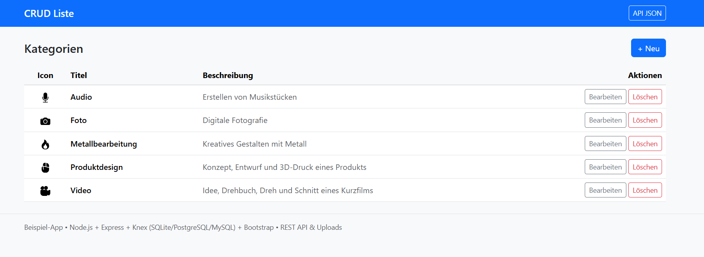


Auf die Datenbankstruktur der Website kann man durch folgende Website zugreifen: 
- https://sqliteviz.com/app/#/workspace
- (https://sqliteonline.com/)

  - 1. data.sqlite einfügen
  - 2. Tabellen werden angezeigt

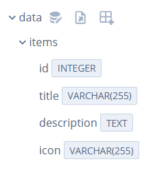

## Donnerstag, 17.10.2025

### *Freigestellt wegen Abslovierung eines Leistungsabzeichens*

## Donnerstag, 23.10.2025

### Versuch: Von sqlite Datenbank zur mysql Datenbank
#### Aktueller Stand:
Da wir die sqlite Datenbank verwenden befindet sich diese jeweils lokal auf dem Computer. Das ist ein großer Nachteil, da man diese nicht gemeinsam verwenden kann. 

#### Lösung:
Verwendung der mysql-Datenbank:
- Es ist neue Datenbank erstellt worden
- Neuer Coding-Space: https://media-challenge.coding-space.at/

#### Erste Versuche:
Ich habe versucht, die Daten (Tabellen, etc.) der sqlite Datenbank auf die mysql Datenbank zu übertragen. Ich habe ebenfalls die Daten der Datenbank in .env erweitert. 

#### Probleme:

Es traten folgende Probleme auf:
- Es konnte keine Verbindung hergestellt werden
- Es wurde Datenbank nicht gefunden
- Anscheinend ist Port 3306 noch nicht freigegeben
- Konnte Programm nicht mehr starten, da nur Fehler angezeigt wurden
- War nicht genau klar, welchen Host ich angeben muss:
  - 1. media-challenge.coding-space.at
  - 2. 10.244.21.7
- Beispielhafte Fehlermeldung:
```terminal
DB init error: Error: connect ECONNREFUSED 89.58.21.6:3306
    at TCPConnectWrap.afterConnect [as oncomplete] (node:net:1637:16) {
  errno: -4078,
  code: 'ECONNREFUSED',
  syscall: 'connect',
  address: '89.58.21.6',
  port: 3306,
  fatal: true
}
```

#### Lösung des Problems:
Ich habe das Projekt auf die vorherige Version zurückgesetzt, wo es noch funktioniert hat.

```terminal
# Zur Version vor MySQL Problemen
--> $ git checkout -b main-funktiuniert de3c551
```
```
Rückmeldung von Deepseek: 

"Die MySQL Database unter 10.244.21.7 ist nicht von deinem Netzwerk aus erreichbar."
```

#### SQL Datenbank -> Tabellen hinzugefügt:
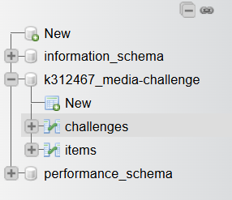


#### Zukunftspläne:
- Datenbank mit Projekt verbinden
- statt sqlite auf sql Datenbank zugreifen

## Samstag, 25.10.2025
### Datenbank
- Umstieg von sqlite auf MySQL

- Datenbank ist auf [coding-space.at](https://coding-space.at/)

### Problem
```
Verbindung kann nicht hergestellt werden! Ich habe eine extra "test-mysql.js" Datei erstellt, um alleine die Verbindung testen zu können. Die Verbindung kann nicht hergestellt werden, wegen folgenden Gründen:

- Die IP 10.244.21.7 ist eine interne Netzwerk-IP
- Sie ist nur aus dem internen Netzwerk erreichbar
- Meine Node.js App (die lokal läuft) kann sie nicht erreichen
```

### Lösung des Problems:

Ich habe die richtigen Serverdaten bekommen

- Die Server-URL für die Datenbank: 
  - DB_HOST: **mysql1507.netcup.net**


### Vorgang:
1. .env-Daten geändert: mySQL
```bash
# Server
PORT=3000
SESSION_SECRET=hcS4CyzKZmdqfPM5BL3d  #random Passwort

#MySQL Database
DB_CLIENT=mysql
DB_HOST=mysql1507.netcup.net
DB_USER=k312467_media-challenge
DB_PASS=rCX7u7Gc@*pr0tzx
DB_NAME=k312467_media-challenge
DB_PORT=3306

# DB_CLIENT=sqlite
# DB_FILE=./data.sqlite
```

2.  SQL-Verbindung testen


Aufruf mit: **node test-mysql.js**
``` javascript
// test-mysql.js
require('dotenv').config();
const { db, init } = require('./db');

async function test() {
  try {
    console.log('Teste MySQL-Verbindung...');
    console.log('Host:', process.env.DB_HOST);
    console.log('Database:', process.env.DB_NAME);
    
    await init();
    
    // Teste Tabellen-Zugriff
    const items = await db('items').select('*');
    const challenges = await db('challenges').select('*');
    
    console.log('ERFOLG! MySQL funktioniert!');
    console.log(`Items: ${items.length} Datensätze`);
    console.log(`Challenges: ${challenges.length} Datensätze`);
    
  } catch (error) {
    console.log('Fehler:', error.message);
    
    if (error.code === 'ER_ACCESS_DENIED_ERROR') {
      console.log('Zugriff verweigert - User/Passwort prüfen');
    } else if (error.code === 'ER_BAD_DB_ERROR') {
      console.log('Datenbank existiert nicht');
    } else if (error.code === 'ECONNREFUSED') {
      console.log('Verbindung verweigert - Host/Port prüfen');
    }
  }
}

test();
```

3. Datensätze hinzufügen


Aufruf mit **insertDb.js**
```js
// insertDb.js
require('dotenv').config();
const { db } = require('./db');

const originalItems = [
  {
    title: "Audio",
    description: "Erstellen von Musikstücken", 
    icon: "/uploads/icon-1759473920639-542278451.svg"
  },
  {
    title: "Foto", 
    description: "Digitale Fotografie",
    icon: "/uploads/icon-1759473910957-54510130.svg"
  },
  {
    title: "Metallbearbeitung",
    description: "Kreatives Gestalten mit Metall",
    icon: "/uploads/icon-1760006525514-978243190.svg"
  },
  {
    title: "Produktdesign", 
    description: "Konzept, Entwurf und 3D-Druck eines Produkts",
    icon: "/uploads/icon-1759473901074-37705088.svg"
  },
  {
    title: "Video",
    description: "Idee, Drehbuch, Dreh und Schnitt eines Kurzfilms", 
    icon: "/uploads/icon-1759474004292-461811549.svg"
  },
  {
    title: "Animation",
    description: "Erstellen von 2D/3D Animationen und Motion Graphics", 
    icon: "/uploads/icon-1760006701694-865921878.svg"
  }
];

async function restoreOriginalItems() {
  try {
    console.log('Stelle originale Kategorien wieder her...');
    
    // Erst alle vorhandenen Items löschen
    await db('items').del();
    console.log('Alte Items gelöscht');
    
    // Neue Items einfügen
    for (const item of originalItems) {
      await db('items').insert(item);
      console.log(`"${item.title}" hinzugefügt`);
    }
    
    console.log('Originale Kategorien erfolgreich wiederhergestellt!');
    console.log('Insgesamt 5 Kategorien angelegt');
    
  } catch (error) {
    console.error('Fehler:', error);
  } finally {
    process.exit();
  }
}

restoreOriginalItems();
```

### Aktuelle Website:
### Kategorien
**Kategorien:**
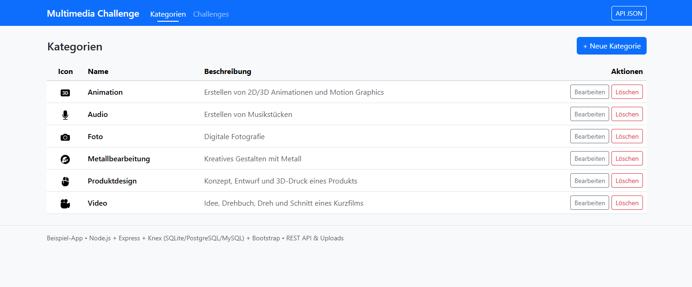

**Neue Kategorie hinzufügen:**
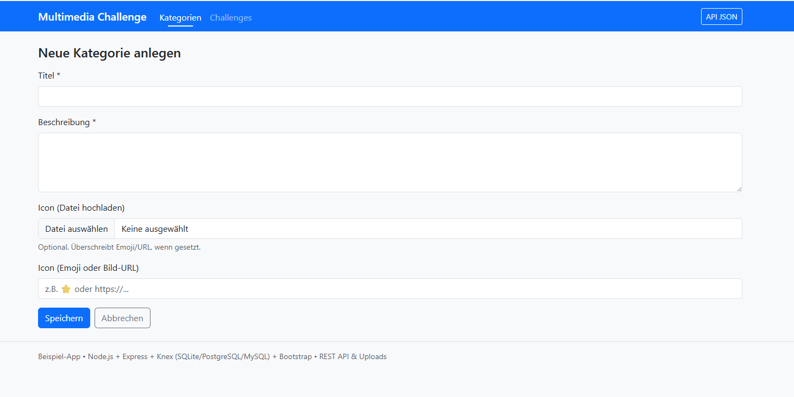

**Kategorie bearbeiten:**
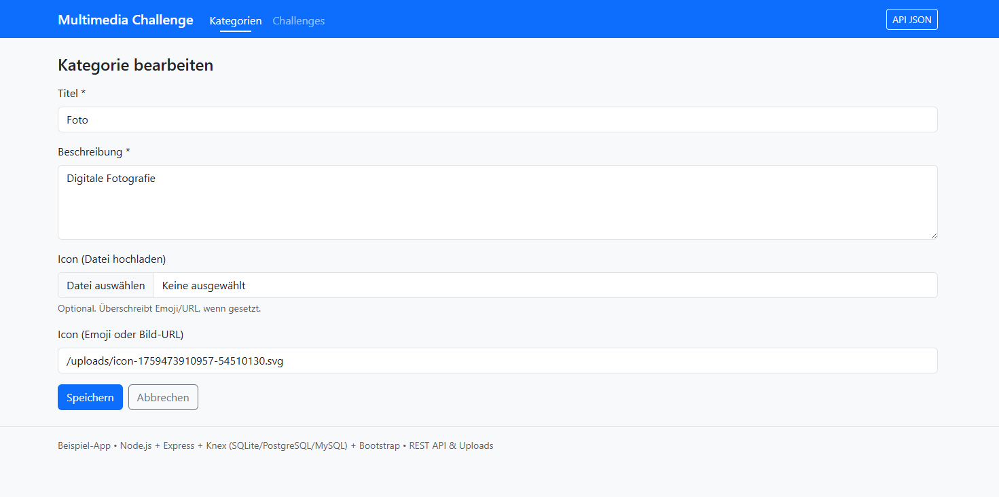

### Challenges

**Challenges:**
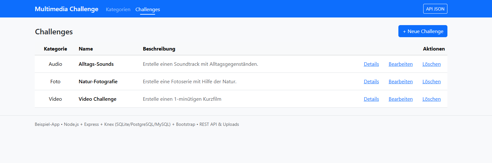

**Neue Challenge hinzufügen:**
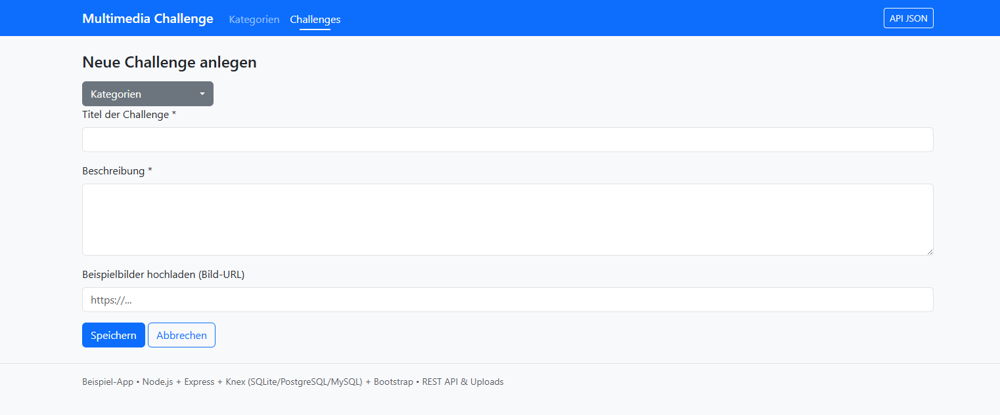

**Challenge bearbeiten:**
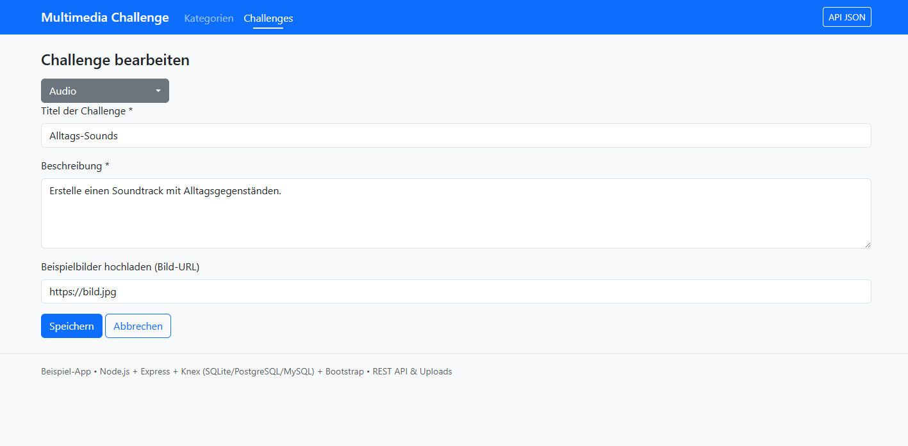


## Dienstag, 28.10.2025

### Neue Funktionen:

- Filtern der Challenges nach Kategorien
- Suchfunktion: Challenges finden

#### Filtern der Challenges nach Kategorien

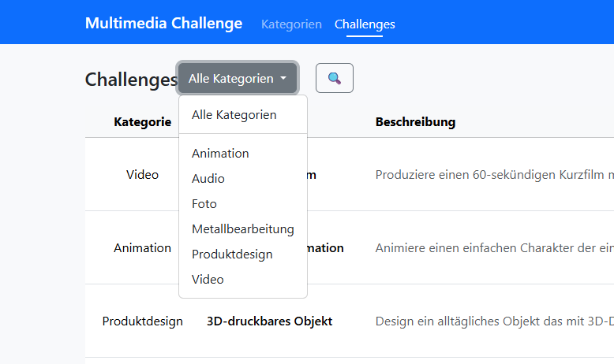


Es ist möglich, dass man die Challenges nach Kategorien filtern kann. Es erzielt eine bessere Übersicht der einzelnen Challenges und verbessert die Benutzerfreundlichkeit.


server.js:
```js
// ----- Challenge Filter nach Kategorie -----
app.get('/challenges/filter/:kategorie', async (req, res) => {
  try {
    const kategorie = req.params.kategorie;
    
    // Alle Challenges der gewählten Kategorie
    const challenges = await db('challenges')
      .where({ kategorie: kategorie })
      .orderBy('title', 'asc');
    
    // Alle Kategorien für das Dropdown
    const kategorien = await db('items').select('*').orderBy('title', 'asc');
    
    res.render('challenges', { 
      challenges: challenges,
      kategorien: kategorien,
      activeKategorie: kategorie,
      activePage: 'challenges'
      
    });
    
  } catch (error) {
    console.error("Fehler beim Filtern:", error);
    req.flash('error', 'Fehler beim Filtern der Challenges');
    res.redirect('/challenges');
  }
});
```

challenges.ejs:
```html
<!-- Filter Dropdown -->
    <div class="dropdown">
      <button class="btn btn-outline-secondary dropdown-toggle" type="button" data-bs-toggle="dropdown">
        <% if (locals.activeKategorie) { %>
          Kategorie: <%= locals.activeKategorie %>
        <% } else { %>
          Alle Kategorien
        <% } %>
      </button>
      <ul class="dropdown-menu">
        <li><a class="dropdown-item" href="/challenges">Alle Kategorien</a></li>
        <li><hr class="dropdown-divider"></li>
        
        <!-- KATEGORIEN LISTE - VEREINFACHT -->
        <% if (locals.kategorien && locals.kategorien.length > 0) { %>
          <% locals.kategorien.forEach(kat => { %>
            <li>
              <a class="dropdown-item <%= locals.activeKategorie === kat.title ? 'active' : '' %>" 
                 href="/challenges/filter/<%= encodeURIComponent(kat.title) %>">
                 <%= kat.title %>
              </a>
            </li>
          <% }) %>
        <% } else { %>
          <li><a class="dropdown-item text-muted" href="#">Keine Kategorien vorhanden</a></li>
        <% } %>
      </ul>
    </div>
    
    <!-- Aktive Filter anzeigen -->
    <% if (locals.activeKategorie) { %>
      <span class="badge bg-primary d-flex align-items-center">
        <%= locals.activeKategorie %>
        <a href="/challenges" class="text-white ms-2 text-decoration-none">×</a>
      </span>
    <% } %>
```


#### Suchfunktion: Challenges finden

Man kann ab jetzt nach Challenges suchen. 
- Wenn man nach einer Challenge sucht, werden bereits schon zutreffende Ergebnisse vorgeschlagen. (Bild 1) 
- Wenn man die Challenge auswählt, wird sie alleine auf der Challenge-Seite angezeigt.(Bild 2)
- Man kann entweder nach Namen oder Beschreibung suchen. Kategorie kann man nicht suchen, da man dafür die Filterfunktion benutzt.

Um die Funktion zu ermöglichen, habe ich nicht nur im server.js gearbeitet, sondern auch direkt im challenges.ejs mit Javascript-Code <"script">. 

**1. Gesuchte Challenge wird bereits vorgeschlagen**

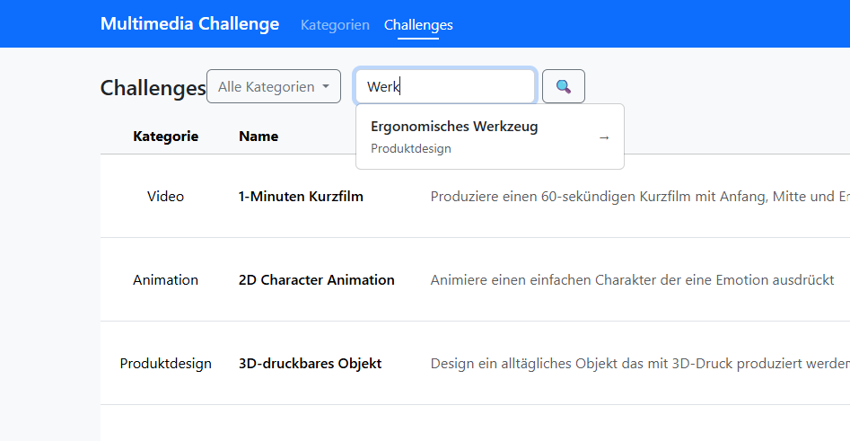

```js
// ----- Challenge Search API -----
app.get('/api/challenges/search', async (req, res) => {
  try {
    const searchTerm = req.query.q;
    
    if (!searchTerm || searchTerm.length < 2) {
      return res.json([]);
    }

    const challenges = await db('challenges')
      .where('title', 'like', `%${searchTerm}%`)
      .orWhere('description', 'like', `%${searchTerm}%`)
      .orWhere('kategorie', 'like', `%${searchTerm}%`)
      .select('*')
      .limit(10);

    res.json(challenges);
    
  } catch (error) {
    console.error("Search error:", error);
    res.status(500).json({ error: 'Search failed' });
  }
});
```

**2. Gesuchte Challenge wird angezeigt**

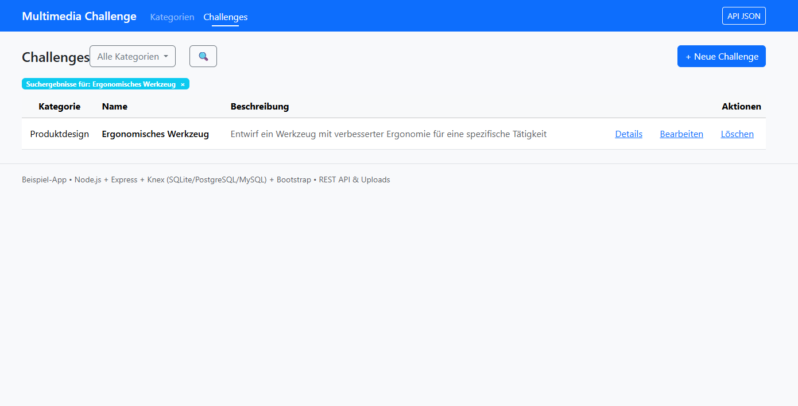

- Problem:
  - Ich habe es für längere Zeit nicht geschafft, nur die gesuchte Challenge anzeigen zu lassen.

- Lösung des Problems:
  - server.js Code abgeändert

```js
// Challenge Detail Route (server.js)
app.get('/challenges/:id', async (req, res) => {
  try {
    const challenge = await db('challenges').where({ id: req.params.id }).first();
    
    if (!challenge) {
      req.flash('error', 'Challenge nicht gefunden.');
      return res.redirect('/challenges');
    }
    
    // Einfache Detailansicht - später ein eigenes Template erstellen (ev.)
    const kategorien = await db('items').select('*').orderBy('title', 'asc');
    
    res.render('challenges', { 
      challenges: [challenge], // Nur diese eine Challenge anzeigen
      kategorien: kategorien,
      activePage: 'challenges',
      searchHighlight: true
    });
    
  } catch (error) {
    console.error("Fehler:", error);
    req.flash('error', 'Fehler beim Laden der Challenge.');
    res.redirect('/challenges');
  }
});

```


## Freitag, 31.10.2025

### Detail-Seite erstellt
- Um eine Gute Übersicht über eine Challenge zu bewahren, gibt es eine Detail-Ansicht. Dort steht noch einmal die Beschreibung und das Beispielbild wird dort angezeigt. Man kann es noch einmal bearbeiten, wenn man möchte, oder wieder zur Startseite zurückkehren. 


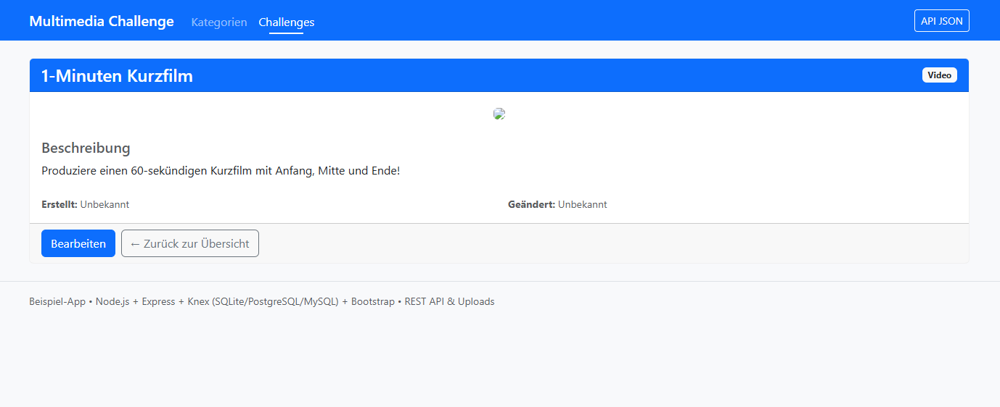

- Man erkennt auf diesem Bild, dass das Beispielfoto zwar schon im Code integriert ist, es kann jedoch nicht angezeigt werden. Im nächsten Schritt wird erklärt, wie die Bilder verwaltet und angezeigt werden können.

### Bilder werden angezeigt

#### Ordner-Struktur geändert
- Unter dem Ordner "uploads" gibt es jetzt einen **challenges** und einen **categories** Ordner, worin alle Bilder gespeichert werden, die beim Erstellen einer Challenges bzw. Kategorie hochgeladen werden. Diese werden wiederum, wenn man die Detail-Ansicht öffnet, auf der Seite angezeigt (bei Challenges).

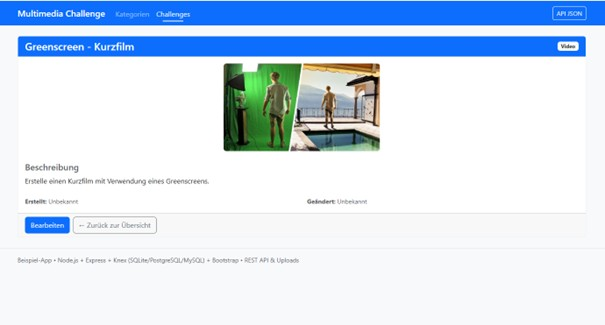

```js
// Storage für Challenges
const challengeStorage = multer.diskStorage({
  destination: (req, file, cb) => {
    const dir = path.join(uploadDir, 'challenges');
    if (!fs.existsSync(dir)) fs.mkdirSync(dir, { recursive: true });
    cb(null, dir);
  },
  filename: (req, file, cb) => {
    const ext = mime.extension(file.mimetype) || 'bin';
    const unique = Date.now() + '-' + Math.round(Math.random()*1e9);
    cb(null, `challenge-${unique}.${ext}`);
  }
});

// Storage für Kategorien
const categoryStorage = multer.diskStorage({
  destination: (req, file, cb) => {
    const dir = path.join(uploadDir, 'categories');
    if (!fs.existsSync(dir)) fs.mkdirSync(dir, { recursive: true });
    cb(null, dir);
  },
  filename: (req, file, cb) => {
    const ext = mime.extension(file.mimetype) || 'bin';
    const unique = Date.now() + '-' + Math.round(Math.random()*1e9);
    cb(null, `category-${unique}.${ext}`);
  }
});

const uploadChallenge = multer({ storage: challengeStorage });
const uploadCategory = multer({ storage: categoryStorage });

```

Mit diesem Code werden nach dem Hochladen von neuen Beispielfotos (je nach dem ob bei Challenge oder Kategorie), die Ordner erstellt. Die Bilder werden jeweils in den richtigen Ordnern gespeichert.
- challenges
- categories

## Weitere/Mögliche Änderungen

- Mehrere Beispielbilder pro Seite hochladen können
- Genauere Beschreibung zusätzlich verfassen können für Detailseite (unter Bearbeiten bzw. Erstellen einer Challenge angeben)
  - Wird nur auf Details-Seite angezeigt


## Donnerstag, 06.11.2025

### Unklarheiten:
#### mySQL - Datenbank Probleme:
  - Wir dürfen die gleiche Datenbank nicht gleichzeitig verwenden

#### mySQL - Datenbank Lösungen:
  - Für funktionelle Änderungen reicht die sqlite Datenbank aus.
  - Haupt Datenbank ist mySQL Datenbank
  - Mit Hotspot (vom Handy) trifft der Fall eher zu, dass die Verbindung zur mySQL Datenbank hergestellt werden kann.

#### mögliche Schüler-Ansicht umsetzen:
  - Wird die Schüleransicht im gleichem Projekt erstellt?
  - Wie soll die Ordnerstruktur verändert werden?
  - Vorschlag:

  ```text
  media-challenge-app/
    ├── server.js
    ├── db.js
    ├── package.json
    ├── .env
    ├── public/
    │   ├── uploads/
    │   │   ├── challenges/
    │   │   └── categories/
    │   └── assets/
    │       └── file-image.svg
    └── views/
        ├── layout.ejs                    # Basis Layout
        │
        ├── admin/                        # ADMIN BEREICH
        │   ├── layout.ejs                # Admin Layout (mit Admin-Nav)
        │   ├── challenges.ejs            # Challenges verwalten
        │   ├── formChallenges.ejs        # Challenge Formular
        │   ├── kategorien.ejs            # Kategorien verwalten  
        │   └── formKategorien.ejs        # Kategorie Formular
        │
        └── schueler/                     # SCHÜLER BEREICH
            ├── layout.ejs                # Schüler Layout (einfache Nav)
            ├── challenges.ejs            # Challenges anzeigen
            ├── challengeDetail.ejs       # Challenge Details
            ├── kategorien.ejs            # Kategorien anzeigen
            └── kategorieDetail.ejs       # Kategorie Details

  ```

  ### Neue Funktionen

  #### Datenbank:

  Bis jetzt konnte man nur Challenges und Kategorien verwalten

  Wir haben jetzt einige Aspkete umgeändert:
  - Fehlerhafte Benennung der Kategorien (noch auf items benannt --> zu categories umgeändert --> Datenbank)
  - Challenges zu Aufgabenpakete umgeändert
  - Challenges (neu) hinzugefügt
  - Schüler hinzugefügt

  #### Funktionen:
  
  Mittlerweile kann man nur Challenges und Kategorien hinzufügen, löschen, bearbeiten, erstellen, etc. Um es mehr funktionsfähig zu machen haben wir 2 neue Seiten erstellt:
  - Challenges
  - Schüler

  **Challenges:**
  - Es werden die Aufgabenpakete und Schüer miteinander verknüpft (ID's)
  - Neue Challenges können erstellt werden durch bzw. mit den Aufgabenpaketen, die bereits schon vorhanden sind. Den einzelnen Challenges werden Teams mit den Schülern zugeteilt. 
  
  Anforderungen: 

  - Titel
  - Beschreibung
  - Zusätzliche Beschreibung
  - Bilder
  - Teams (Schüler)
  - etc.

  Grundsätzlich ist diese Seite gleich aufgebaut wie die Aufgabenpaketseite. Der einzige Unterschied ist, das mehrere Informationen zu finden sind. Es werden die schon bereits vorhandenen Aufgabenpakete und die hinzugefügten Schüler verwendet, um die Challenges zu erstellen, die dann sichtbar für die Schüler gemacht werden.

  **Schüler**

  Unter der Seite "Schüler" werden Schüler der Medienzweig-Klassen hinzugefügt.

  Anforderungen:
  - Vorname
  - Nachname
  - Klasse (1BHELS, 2BHELS, 3BHELS, 4BHELS oder 5BHELS)

  Mit deren ID's können sie in den Aufgabenpaketen mit ein integriert werden.

  ### Aktuelle Seite:

  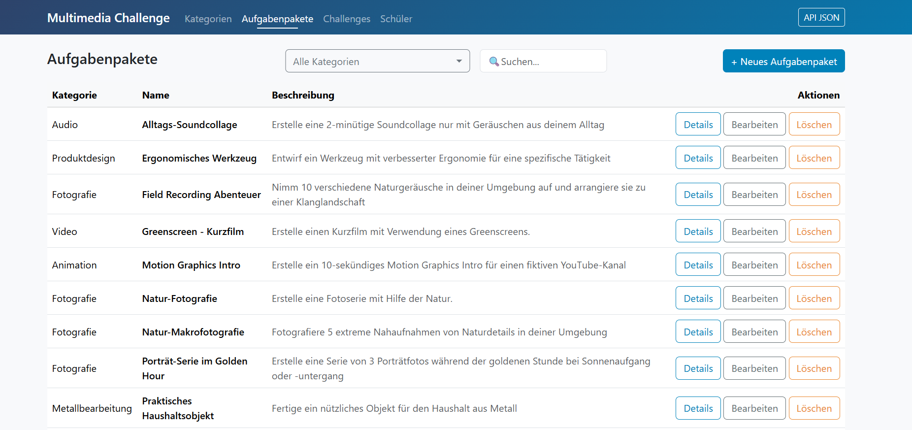


  ## Donnerstag, 09.11.2025

  ### Challenges und Schüler weiterbearbeitet

  #### Challenges
  - Aufgabenpakete und Schüler (Teams) können schon miteinander verknüpft werden. 
  - Das Bearbeiten funktioniert von den Challenges.

  #### Schüler
  - Schüler können den Klassen zugewiesen werden
  - Schüler können den Challenges mit Abteilungen zugewiesen werden
  - Schüler können beim Challenge erstellen ausgewählt werden. Es wird dann automatisch eine Gruppe erstellt.


  ## Donnerstag, 13.11.2025

  ### Suchfunktionen

  - Es wurde ermöglicht, dass Live gefiltert bzw. gesucht werden kann. 


### Aktuelle Seiten:

#### Kategorien:

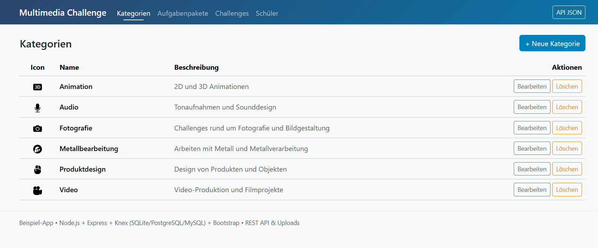


#### Aufgabenpakete:


#### Challenges:

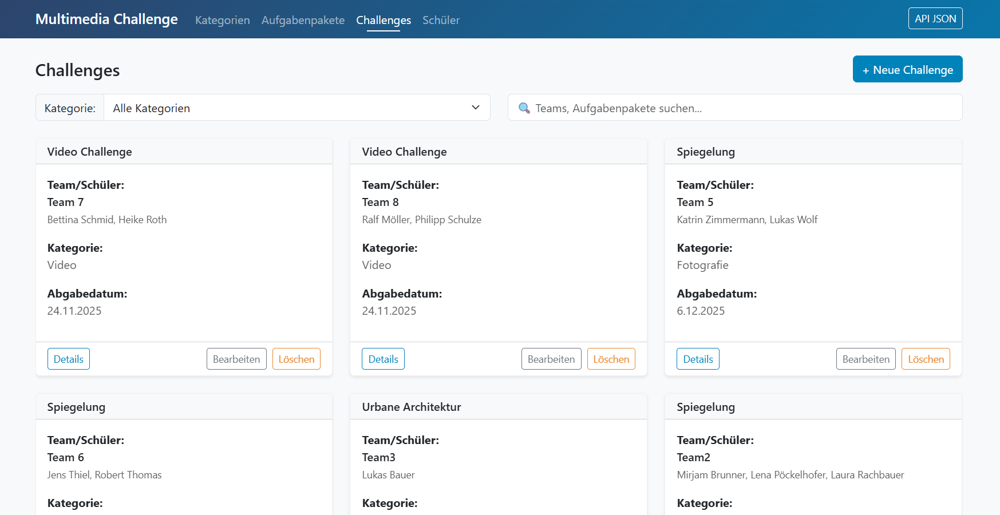

Challenge erstellen: Aufgabenpakete:


Man kann beim Challenge erstellen ein Aufgabenpaket auswählen, das man davor schon erstellt hat. 

Challenge erstellen: Teams


Es können die Schüler in das Feld gezogen werden. Wenn man auf "Team erstellen" drückt, wird ein Team mit den Schülern erstellt. Man kann so viele Teams erstellen, so viele man möcht, bis dass man auf Challenge erstellen drückt.

#### Schüler:

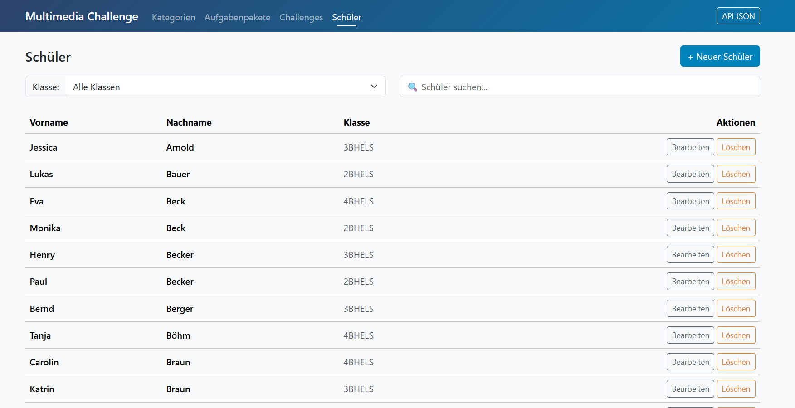

 
 Suchleiste:

- Die Suchleiste ist bei Aufgabenpakete, Challenges und Schüler integriert
- Wenn man etwas sucht werden die Ergebnisse live gefiltern

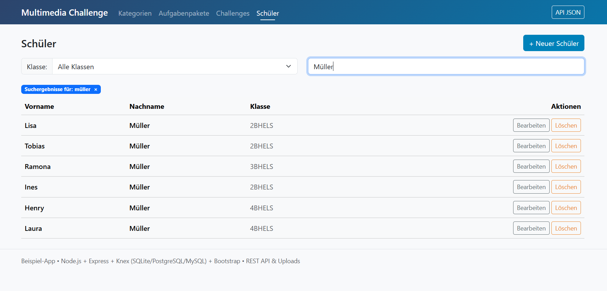

Bei diesem Bild erkennt man, dass nach dem Nachnamen "Müller" gesucht wird. Man kann ebenfalls nach Vorname und Klasse suchen. 


 Filterfunktion:

- Es können die Schüler nach Klassen sortiert werden
  - 2BHELS
  - 3BHELS
  - 4BHELS

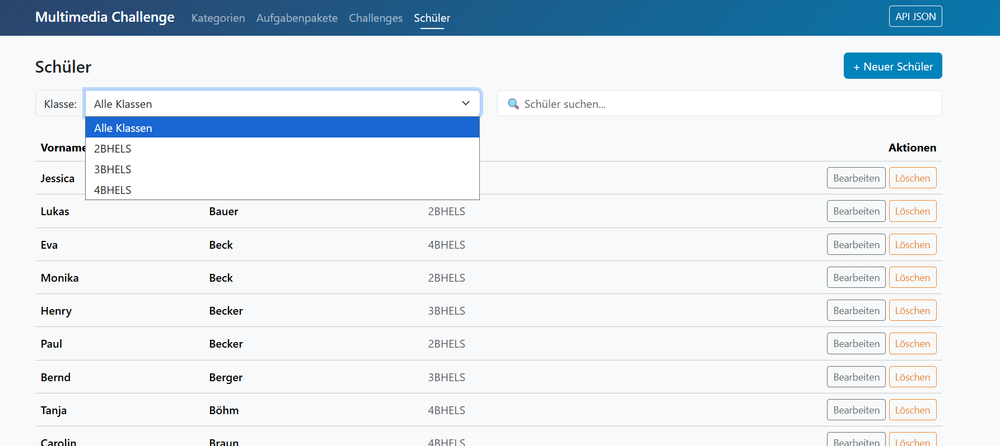


#### Nächste Schritte
- Jahrgang - Filter einbauen (2020/21, 2024/25...)
- Server.js umstrukturieren! --> schon zu viel Code

## Mittwoch, 19.11.2025


### Datenbank-Struktur: Media Challenge System

### Überblick

Die Datenbank `k312467_media-challenge` ist eine MySQL-Datenbank für ein Multimedia-Challenge-Management-System, das Schüler, Teams, Aufgabenpakete und Challenges verwaltet.

### Tabellen-Struktur

#### 1. **categories** - Kategorien

```sql

id (INT, PK)
title (VARCHAR 255)        -- Kategoriename (z.B. "Fotografie")
description (TEXT)         -- Beschreibung der Kategorie
icon (VARCHAR 500)         -- Icon-Pfad oder URL
```

**Beispieldaten:**

- Fotografie, Video, Audio, Produktdesign, Metallbearbeitung, Animation
    

#### 2. **aufgabenpakete** - Aufgabenpakete


```sql

id (INT, PK)
title (VARCHAR 255)        -- Titel des Aufgabenpakets
description (TEXT)         -- Beschreibung der Aufgabe
icon (VARCHAR 500)         -- Icon/Bild für das Paket
kategorie (VARCHAR 255)    -- Zugehörige Kategorie
start_date, end_date (DATE)-- Optional: Zeitraum
```
**Beispieldaten:**

- Video Challenge, Natur-Fotografie, Time-Lapse Projekt, etc.
    

#### 3. **klassen** - Schulklassen

```sql

id (INT, PK)
name (VARCHAR 50)          -- Klassenname (z.B. "2BHELS")
created_at, updated_at (TIMESTAMP)
```

**Beispieldaten:**

- 2BHELS, 3BHELS, 4BHELS
    

#### 4. **schuljahre** - Schuljahre


```sql

id (INT, PK)
name (VARCHAR 20)          -- Schuljahr (z.B. "2024/25")
startjahr, endjahr (INT)   -- Start- und Endjahr
aktiv (TINYINT)            -- Aktuelles Schuljahr
```
**Beispieldaten:**

- 2023/24, 2024/25 (aktiv), 2025/26
    

#### 5. **schueler** - Schüler


```sql

id (INT, PK)
vorname, nachname (VARCHAR 100)
klasse_id (INT, FK)        -- Verweis auf Klassen
schuljahr_id (INT, FK)     -- Verweis auf Schuljahre
created_at, updated_at (TIMESTAMP)`
```

**Beispieldaten:**

- 112 Schüler mit Namen wie "Mirjam Brunner", "Max Mustermann"
    

#### 6. **teams** - Schülergruppen


```sql

id (INT, PK)
name (VARCHAR 255)         -- Teamname
schuljahr_id (INT, FK)     -- Verweis auf Schuljahre
created_at, updated_at (TIMESTAMP)`
```

**Beispieldaten:**

- Team1, Team2, Team 5-8
    

#### 7. **team_mitglieder** - Team-Zuordnungen

```sql

id (INT, PK)
team_id (INT, FK)          -- Verweis auf Teams
schueler_id (INT, FK)      -- Verweis auf Schüler
rolle (ENUM)               -- 'mitglied' oder 'teamleiter'
```

**Beispieldaten:**

- Team-Zuordnungen mit Rollenverteilung
    

#### 8. **challenges** - Challenge-Instanzen

```sql

id (INT, PK)
aufgabenpaket_id (INT)     -- Verweis auf Aufgabenpaket
title, beschreibung (TEXT) -- Challenge-Details
kategorie (VARCHAR 255)    -- Kategorie
icon (VARCHAR 500)         -- Icon/Bild
zusatzinfos (TEXT)         -- Zusätzliche Informationen
abgabedatum (DATE)         -- Abgabefrist
team_id (INT, FK)          -- Zugewiesenes Team
schueler_id (INT)          -- Einzelschüler (optional)
erreichte_punkte (INT)     -- Bewertung
feedback (TEXT)            -- Lehrer-Feedback
abgabe_url (TEXT)          -- Abgabe-Link
schuljahr_id (INT, FK)     -- Schuljahr
created_at, updated_at (TIMESTAMP)
```

**Beispieldaten:**

- 7 aktive Challenges mit verschiedenen Aufgabenpaketen
    

#### 9. **challenge_bilder** - Challenge-Medien

```sql

id (INT, PK)
challenge_id (INT, FK)     -- Verweis auf Challenge
bild_url (VARCHAR 500)     -- Pfad/URL zum Bild
beschreibung (TEXT)        -- Bildbeschreibung
reihenfolge (INT)          -- Sortierreihenfolge
```

### Beziehungen (Foreign Keys)

text

categories
    ↑
aufgabenpakete (kategorie)
    ↑
challenges (aufgabenpaket_id) ← challenge_bilder
    ↑
teams ← team_mitglieder → schueler → klassen
    ↑
schuljahre

### Schlüssel-Features

1. **Mehrsprachige Struktur**: Unterstützt verschiedene Medienkategorien
    
2. **Team-Management**: Flexible Team-Zuordnungen mit Rollen
    
3. **Schuljahres-basiert**: Trennung nach Schuljahren
    
4. **Bewertungssystem**: Punktevergabe und Feedback
    
5. **Medien-Upload**: Unterstützung für Bilder und URLs
    
6. **Flexible Zuordnungen**: Einzel- oder Team-Challenges
    

### Verwendungszweck

Die Datenbank verwaltet ein komplettes Challenge-System für Schulen, bei dem:

- Lehrer Aufgabenpakete in verschiedenen Kategorien erstellen
    
- Schüler in Teams Challenges bearbeiten
    
- Abgaben und Bewertungen verwaltet werden
    
- Alle Daten schuljahresweise getrennt werden
    

Die Struktur ist skalierbar und unterstützt verschiedene Multimedia-Bereiche wie Fotografie, Video, Audio, Design und handwerkliche Arbeiten.

## Donnerstag, 20.11.2025

### Umstellung von Server.js

- Bis jetzt war das Problem, dass der ganze Code zu allen Seiten in einem Javascript sich befunden hat. Das Problem wurde gelöst, indem dass neue Javascripts erstellt wurden.
- Neue .js:
  - aufgabenpakete.js
  - challenges.js
  - categories.js
  - index.js
  - schueler.js
  - api
    index.js

#### server.js:

Im Server.js werden alle anderen .js miteingebunden. Es wird mit app.use auf die anderen Seiten hingeleitet. Damit wird die Strukturierung um einiges verbessert.


#### index.js:

Bei index.js wird sofort auf die Startseite (Kategorien) hingeleitet. Weiters werden die Informationen von .env abgerufen. --> Datenbankinformationen

#### api/index.js:
Das index.js in api wird dafür verwendet, damit auf den einzelnen Seiten gesucht werden kann. Für weitere Zwecke wird das nicht genutzt.

#### middleware/uploads.js
In uploads.js befinden sich alle Middleware Codeausschnitte. Dies dient wiederum für eine bessere Strukturierung.


### Teams verwalten

- Das Problem war, dass beim Bearbeiten die davor bereits ausgewählten Teams nicht mehr angezeigt wurden. Dieses Problem wurde behoben.

### Filtern nach Schuljahr

Um die Strukturierung nicht nur im Moment zu ermöglichen und diese auch in Zukunft beizubehalten, wurde das Schuljahr in die Datenbank hinzugefügt. (neue Tabelle)
- Damit kann man nach Challenges und Schüler von verschiedenen Jahrgängen suchen
- Es werden die folgenden Tabellen mit der Schuljahr - ID von der Tabelle Schüler verbunden


### Korrektur Sqlite Datenbank --> Schuljahr

- Diese Datenbank muss auch immer wieder neben der mySQL Datenbank auf den aktuellen Stand gebracht werden. 
- https://sqliteviz.com/app/#/workspace  --> Datenbankvisualisierung

#### Schuljahr Tabelle erstellen

```js
// 1. Prüfe ob Schuljahre-Tabelle existiert
    const schuljahreExists = await db.schema.hasTable('schuljahre');
    if (!schuljahreExists) {
      console.log(' Schuljahre-Tabelle existiert nicht! Bitte zuerst schemaDb.js ausführen.');
      return;
    }
    console.log(' Schuljahre-Tabelle vorhanden');

    // 2. Standard-Schuljahr erstellen falls keines existiert
    const schuljahreCount = await db('schuljahre').count('* as count').first();
    if (schuljahreCount.count === 0) {
      console.log(' Erstelle Standard-Schuljahre...');
      await db('schuljahre').insert([
        { name: '2023/24', startjahr: 2023, endjahr: 2024, aktiv: 0 },
        { name: '2024/25', startjahr: 2024, endjahr: 2025, aktiv: 1 },
        { name: '2025/26', startjahr: 2025, endjahr: 2026, aktiv: 0 }
      ]);
      console.log(' Standard-Schuljahre erstellt');
    }
```
#### Challenges-Tabelle

Schuljahr in Tabelle "Challenges" hinzufügen: 

```js
  if (!challengesHasSchuljahr) {
      // Spalte hinzufügen
      await db.raw('ALTER TABLE challenges ADD COLUMN schuljahr_id INTEGER');
      console.log(' schuljahr_id zu challenges hinzugefügt');
      
      // Bestehende Challenges mit aktivem Schuljahr updaten
      const updateResult = await db('challenges')
        .whereNull('schuljahr_id')
        .update({ schuljahr_id: aktivesSchuljahr.id });
      
      console.log(` ${updateResult} Challenges mit Schuljahr ${aktivesSchuljahr.name} aktualisiert`);
    } else {
      console.log(' challenges hat bereits schuljahr_id Spalte');
      
      // Prüfe ob Challenges ohne Schuljahr existieren
      const challengesWithoutSchuljahr = await db('challenges')
        .whereNull('schuljahr_id')
        .count('* as count')
        .first();
      
      if (challengesWithoutSchuljahr.count > 0) {
        const updateResult = await db('challenges')
          .whereNull('schuljahr_id')
          .update({ schuljahr_id: aktivesSchuljahr.id });
        
        console.log(` ${updateResult} Challenges mit Schuljahr aktualisiert`);
      }
    }
```

#### Schüler-Tabelle

Schuljahr in Tabelle "Schüler" hinzufügen: 

```js
if (!schuelerHasSchuljahr) {
      // Spalte hinzufügen
      await db.raw('ALTER TABLE schueler ADD COLUMN schuljahr_id INTEGER');
      console.log(' schuljahr_id zu schueler hinzugefügt');
      
      // Bestehende Schüler mit aktivem Schuljahr updaten
      const updateResult = await db('schueler')
        .whereNull('schuljahr_id')
        .update({ schuljahr_id: aktivesSchuljahr.id });
      
      console.log(` ${updateResult} Schüler mit Schuljahr ${aktivesSchuljahr.name} aktualisiert`);
    } else {
      console.log('⏭ schueler hat bereits schuljahr_id Spalte');
      
      // Prüfe ob Schüler ohne Schuljahr existieren
      const schuelerWithoutSchuljahr = await db('schueler')
        .whereNull('schuljahr_id')
        .count('* as count')
        .first();
      
      if (schuelerWithoutSchuljahr.count > 0) {
        const updateResult = await db('schueler')
          .whereNull('schuljahr_id')
          .update({ schuljahr_id: aktivesSchuljahr.id });
        
        console.log(` ${updateResult} Schüler mit Schuljahr aktualisiert`);
      }
    }

```

#### Schüler-Tabelle

Schuljahr in Tabelle "Teams" hinzufügen:

```js
console.log(' Migriere teams Tabelle...');
    const teamsHasSchuljahr = await db.schema.hasColumn('teams', 'schuljahr_id');
    
    if (!teamsHasSchuljahr) {
      // Spalte hinzufügen
      await db.raw('ALTER TABLE teams ADD COLUMN schuljahr_id INTEGER');
      console.log(' schuljahr_id zu teams hinzugefügt');
      
      // Bestehende Teams mit aktivem Schuljahr updaten
      const updateResult = await db('teams')
        .whereNull('schuljahr_id')
        .update({ schuljahr_id: aktivesSchuljahr.id });
      
      console.log(` ${updateResult} Teams mit Schuljahr ${aktivesSchuljahr.name} aktualisiert`);
    } else {
      console.log('⏭ teams hat bereits schuljahr_id Spalte');
    }

```

#### Problem

Wir müssen versuchen, sodass sich das Schuljahr immer wieder aktualisiert, damit es sich jedes Jahr automatisch anpasst. Bis jetzt wurde es mit mittels Datenbank per Hand zugeteilt. Bis jetzt sind die Jahre 2022/23, 2023/24, 2025/26 vorhanden.


## Donnerstag, 27.11.2025

### Error-Verhalten

Um einen Fehler direkt zu erkennen, wurden zwei .ejs Seiten mit den Namen 404.ejs und 500.ejs erstellt.

#### 404.ejs

Diese Seite wird aufgerufen, wenn etwas nicht gefunden wird. Beispiele dafür:

```txt
Beispiele:

      http://localhost:3000/gibtsnicht

      http://localhost:3000/challenges/999999 (nicht existierende ID)

      http://localhost:3000/alte-seite-die-es-nicht-mehr-gibt

      http://localhost:3000/favicon.ico (wenn kein Handler da ist)
```


#### 500.ejs

Diese Seite wird aufgerufen, wenn ein Server-Fehler auftritt. Beispiele dafür: 

```txt
Beispiele:

      Datenbank-Fehler (Tabelle existiert nicht)

      Syntax-Fehler im Code

      Fehlende Variablen

      Route-Code wirft einen Error
```

Es hilft, Fehler gut zu umgehen und zu erfahren, welche Fehler gemacht wurden. 


### Weitere Überlegungen für die Schüler-Ansicht

#### Aktuelle Strukturierung

```text
  media-challenge-app/
      ├──  Datenbank/
      │   ├──  schemaDb.js
      │   └──  seedDb.js
      ├──  middleware/
      │   └──  uploads.js
      ├──  node_modules/
      ├──  public/...
      ├──  routes/
      │   ├──  api/
      │   │   └──  index.js
      │   ├──  aufgabenpakete.js
      │   ├──  categories.js
      │   ├──  challenges.js
      │   ├──  index.js
      │   └──  schueler.js
      ├──  views/
      │   ├──  error/
      │   ├──  aufgabenpakete.ejs
      │   ├──  aufgabenpaketeDetail.ejs
      │   ├──  challenges.ejs
      │   ├──  challengesDetail.ejs
      │   ├──  formAufgabenpakete.ejs
      │   ├──  formChallenges.ejs
      │   ├──  formKategorien.ejs
      │   ├──  formSchueler.ejs
      │   ├──  index.ejs
      │   ├──  layout.ejs
      │   └──  schueler.ejs
      ├──  .env
      ├──  .env.example
      ├──  .gitignore
      ├──  data.sqlite
      ├──  db.js
      ├──  package-lock.json
      ├──  package.json
      ├──  README.md
      ├──  reset-db.js
      └──  server.js

  ```

  #### Mögliche Erweiterung: 

  - Views:
    - Es werden drei Ordner erstellt:
      - admin
      - schueler
      - shared
  
  Damit werden die Schüler von der Admin Funktion getrennt. Grundsätzlich sind es die gleichen Funktionen, nur dass der Admin mehr Rechte hat als der:die Schüler:in. Das heißt, dass man die Codes 1:1 umkopieren kann, und man nur noch die Codes anpassen muss. 


  ### Ziel für heute: 

  Neue Datenbanktabelle hinzufügen und eine bereits Vorhandene anpassen.

**Neue Datenbanktabelle:**

  - user_role
    - id | rolle

  - Beispiel
    - 2 | Lehrer
    - 3 | Admin


 *Tabelle generieren*

```sql
CREATE TABLE user_roles (
  id INT PRIMARY KEY AUTO_INCREMENT,
  rolle VARCHAR(50) NOT NULL UNIQUE
);

INSERT INTO user_roles (id, rolle) VALUES
(1, 'Schüler'),
(2, 'Lehrer'), 
(3, 'Admin');
```
  **Bereits vorhandene Tabelle:**
  
  Schüler - > User

  - user
    - user_role_id | Vorname Nachname


**Was jetzt gemacht werden soll:**
- Es sollen die Rechte verteilt werden
- Wir nehmen immer gleiches Programm her. 
  - ABER: Es werden viele IF's verwendet:
    - Damit können Gewisse Ausschnitte dem Schüler, gewisse Ausschnitte dem Lehrer und Gewisse Ausschnitte als Ansicht für die jeweiligen Rollen dargestellt werden. das macht man mit den jeweiligen user_role_id's!
    - if user_role_id == 1 ...Schüler --> kann keine Challenges erstellen, etc.


## Samstag, 29.11.2025

### Ziel: Login

- Es wurden die ersten Schritte für den Login erledigt
- Mit 1, 2, 3 anmelden ODER mit Benutzernamen (Vor- und Nachname)
- Es ist jetzt folgendes möglich:
  - Man kann sich mit 1 (Schüler), 2 (Lehrer) und 3 (Admin) einloggen.
    - Vorteil: man kann schnell und einfach die Ansichten testen, ohne dass man die ganze Zeit richtige Nutzerdaten eingeben muss (Bunutzername & Passwort)
  - Man kann sich jetzt auch mit ganzem Namen einloggen
    - Wir haben das jetzt auch schon ermöglicht, damit man der Website schon eine realistische Verwendung zuordnen kann (Zukunft: LDAP von Schule für Schüler - Lehrer - Admin)
    - Wenn man einen Namen eingibt, der bereits schon in der Datenbank gespeichert ist in einer bestimmten Rolle, wird man sofort als die Rolle angemeldet (z.B. Mirjam Brunner --> login --> Schüler, Daniela Nobis --> Login --> Admin, Christian Hanl --> login --> Lehrer)


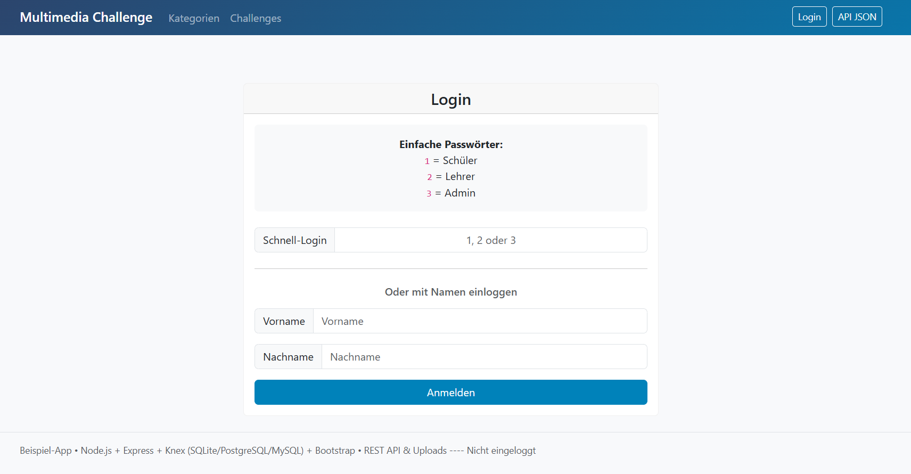


### Verschiedene Ansichten durch unterschiedliche Rollen

Mit dem Login ist es möglich, die Rollen auseinander zu halten und dementsprechend die Ansichten anzupassen. Der Admin sieht ja zum Beispiel um einiges mehr als die Schüler, und hat auch mehr Rechte auf der Website.

#### Schüler:
- Sieht nur Challenges, wobei er:sie zugeordnet wurde, und Kategorien

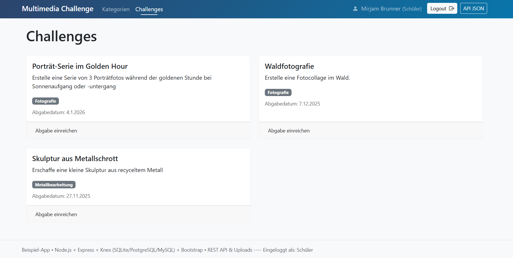

#### Lehrer:
- Sieht bis jetzt alles, was der Admin sieht (muss noch geändert werden)

#### Admin:
- Sieht alles!! Kann alle Änderungen vornehmen und hat alle Rechte.


## Donnerstag, 04.12.2025

### Aktuelle Struktur: 


```text
  media-challenge-app/
      ├──  Datenbank/
      │   ├──  schemaDb.js
      │   └──  seedDb.js
      ├──  middleware/
      │   └──  uploads.js
      │   └──  auth.js
      ├──  node_modules/
      ├──  public/...
      ├──  routes/
      │   ├──  api/
      │   │   └──  index.js
      │   ├──  aufgabenpakete.js
      │   ├──  auth.js
      │   ├──  categories.js
      │   ├──  challenges.js
      │   ├──  index.js
      │   └──  schueler.js
      ├──  views/
      │   ├──  404.ejs/
      │   ├──  550.ejs/
      │   ├──  challenges/index.ejs
      │   ├──  aufgabenpakete.ejs
      │   ├──  aufgabenpaketeDetail.ejs
      │   ├──  challenges.ejs
      │   ├──  challengesDetail.ejs
      │   ├──  formAufgabenpakete.ejs
      │   ├──  formChallenges.ejs
      │   ├──  formKategorien.ejs
      │   ├──  formSchueler.ejs
      │   ├──  index.ejs
      │   ├──  layout.ejs
      │   ├──  login.ejs
      │   └──  schueler.ejs
      ├──  .env
      ├──  .env.example
      ├──  .gitignore
      ├──  data.sqlite
      ├──  db.js
      ├──  package-lock.json
      ├──  package.json
      ├──  README.md
      ├──  reset-db.js
      └──  server.js
  ```

  ### Challenges bearbeiten und speichern repariert

  - Es wurde ein Fehler gefunden: Nach dem Bearbeiten einer Challenge in verwendung mit den Teams, war es nicht möglich, diese artsgerecht zu speichern, obwohl es beim normalen Challenge erstellen schon funktioniert. Der Fehler war, dass das PUT nicht korrekt codiert war. Es wurden die Teams nicht richtig gespeichert.


  ### Upload von Medien der Schüler ermöglichen

  ---

  ### **ERSTE VORSTELLUNGEN VON KI:**

  #### **📸 GALERIE-ANSICHT für hochgeladene Bilder:**

#### **1. LIGHTBOX-GALERIE (wie Instagram/Facebook)**


```text
┌─────────────────────────────────────────┐
│  ⬅️ [X] Bild 3/5  ➡️                    │
│                                         │
│            ┌─────────────┐              │
│            │             │              │
│            │   BILD      │              │
│            │   GROSS     │              │
│            │             │              │
│            └─────────────┘              │
│                                         │
│  🔽 Download  ♥ Like  💬 Kommentar      │
│  Titel: "Natur am See"                  │
└─────────────────────────────────────────┘
```

#### **2. GRID-ANSICHT (Übersicht)**

```text

┌─────┬─────┬─────┬─────┐
│ ███ │ ███ │ ███ │ +   │ ← Thumbnails
│ ███ │ ███ │ ███ │(neu)│
│ ███ │ ███ │ ███ │     │
└─────┴─────┴─────┴─────┘
Klick auf Thumbnail → Lightbox öffnet

```

### **DOWNLOAD-FUNKTIONALITÄT:**

#### **1. EINZEL-DOWNLOAD pro Bild:**


```html
<!-- Unter jedem Bild in der Galerie -->
<button class="btn btn-sm btn-outline-primary download-btn" 
        data-url="/download/abgabe_12345.jpg"
        data-filename="natur_see_max.jpg">
  <i class="bi bi-download"></i> Original herunterladen
</button>
<!-- Rechtsklick auf Bild → "Bild speichern unter..." -->
<!-- Oder Direkt-Link: -->
<a href="/uploads/abgaben/.../foto.jpg" download="mein_foto.jpg">

```


#### **2. BATCH-DOWNLOAD (Alle Bilder als ZIP):**

```html
<button class="btn btn-primary" id="downloadAllBtn">
  <i class="bi bi-file-zip"></i> Alle Bilder als ZIP (45 MB)
</button>

```


<!-- Erstellt automatisch: "Abgabe_Challenge23_Team45.zip" -->

### **SPEICHERN in lokalen Ordner (vom Browser):**

#### **Browser-Funktionen:**

1. **"Speichern unter..."** → Wählt selbst Ordner (100% Qualität)
    
2. **Drag & Drop** aus Browser in Explorer/Finder
    
3. **Download-Manager** des Browsers
    

#### **Dein Code ermöglicht:**


```javascript
// 1. Original-Auflösung BEIBEHALTEN:
// Server sendet Datei 1:1 wie hochgeladen
res.download(filePath, originalFileName);

// 2. Metadaten erhalten:
// EXIF-Daten (Kamera, Datum, GPS) bleiben erhalten
// Keine Komprimierung

// 3. Dateinamen sinnvoll:
// Statt "abgabe_12345_xyz.jpg" → "Naturfoto_Max_Mustermann.jpg"
const downloadName = `${abgabe.titel}_${user.vorname}_${user.nachname}.jpg`;

```

### **QUALITÄTS-ERHALT:**

#### **Original bleibt ORIGINAL:**


```text
Hochgeladen:            Heruntergeladen:
1920x1080 Pixel  →      1920x1080 Pixel
5.2 MB           →      5.2 MB 
JPEG Quality 95  →      JPEG Quality 95
EXIF Daten       →      EXIF Daten erhalten
```
### **Keine automatische Komprimierung!**

```javascript

// ❌ NICHT tun (verlustbehaftet):
sharp(filePath)
  .resize(800)          ← Auflösung reduziert
  .jpeg({ quality: 80 }) ← Qualität reduziert
  .toFile(...)

// ✅ SO tun (originalgetreu):
fs.createReadStream(filePath).pipe(res); // 1:1 Stream

```
### **BENUTZERERLEBNIS:**

#### **Für Schüler beim Hochladen:**


[Datei auswählen] "natur_foto_hochaufloesend.jpg" (12 MB)
✅ Upload erfolgreich!

```text
┌─────────────────────┐
│  VORSCHAU:          │
│                     │
│  ████████████████   │ ← Sofortige Thumbnail-Vorschau
│  ████████████████   │
│                     │
│  📏 1920x1080       │ ← Auflösung anzeigen
│  💾 12.4 MB         │ ← Dateigröße
│  📅 Original: Heute │ ← EXIF-Datum
└─────────────────────┘
```
🔄 Mehr Bilder hinzufügen
💾 Alle Originale behalten

#### **Nach der Abgabe:**


ABGABE ÜBERSICHT:
```text
┌──────────────────────────────────┐
│ 📸 Meine Bilder (5)              │
│                                  │
│ [Thumb1][Thumb2][Thumb3]...      │ ← Klickbar
│                                  │
│ 📥 AKTIONEN:                     │
│ • Einzelne Bilder herunterladen  │
│ • Alle als ZIP (54 MB)           │
│ • In Cloud speichern (optional)  │
│ • Drucken (hochauflösend)        │
└──────────────────────────────────┘
```
### **LOKALE SPEICHERUNG auf Nutzer-PC:**

#### **Browser-APIs für "Save to folder":**


```javascript
// Neuere Browser (Chrome/Edge):
async function saveToFolder(fileUrl, fileName) {
  const response = await fetch(fileUrl);
  const blob = await response.blob();
  
  // File System Access API (modern)
  const handle = await window.showSaveFilePicker({
    suggestedName: fileName,
    types: [{
      description: 'JPEG Image',
      accept: {'image/jpeg': ['.jpg']}
    }]
  });
  
  const writable = await handle.createWritable();
  await writable.write(blob);
  await writable.close();
}

// Fallback für alle Browser:
function downloadFile(fileUrl, fileName) {
  const a = document.createElement('a');
  a.href = fileUrl;
  a.download = fileName; // Browser fragt nach Speicherort
  a.click();
}
`
```

### ** ZUSAMMENFASSUNG der Features:**

1. **Galerie-View** mit Lightbox (wie Social Media)
    
2. **Thumbnail-Übersicht** aller Uploads
    
3. **Einzel-Download** mit Rechtsklick/"Speichern unter"
    
4. **Batch-Download** als ZIP
    
5. **Original-Qualität** bleibt 100% erhalten
    
6. **Metadaten** (EXIF) bleiben erhalten
    
7. **Datei-Info** anzeigen (Größe, Auflösung, Datum)
    
8. **Drag & Drop** aus Browser in Ordner möglich
    
9. **Cloud-Speicherung** optional (Google Drive, etc.)
    
10. **Druck-Funktion** für hochauflösende Ausdrucke
    

*ENDE VON KI-INFOS*

----

### Upload von Fotos:

#### Code-Einbindung:
- Es soll grundlegend so wie bei den Aufgabenpaketen gestaltet werden. Die Bilder werden im Uploads Ordner gespeichert, wobei diese in Ordner-Struktur eingeteilt sind.  

#### Funktionen bei der Webiste

- Die Schüler können Bilder von Dokumenten oder Galerie auswählen. Diese werden dann hinzugefügt und bei der Übersicht angezeigt. Diese können dann abgegeben oder als Entwurf gespeichert werden. 


#### **Aspekte, die noch ausgearbeitet werden müssen:**

**Speichervorgang von Medien**

- Wenn Bilder ausgwählt werden, werden sie direkt in Uploads gespeichert. Eventuell kann ma das so machen, dass die Bilder erst gespeichert werden, wenn man diese Abgibt oder auch als Entwurf speichert.

**Auswahl von Medien aus Explorer:**
- Wenn man die Bilder beim Upload auswählt und auf weiter drückt, werden diese noch nicht im Anzeigefeld angezeigt und das Auswahlfenster popt wieder auf, wobei man wieder Bilder auswählen muss. Wenn man das nochmal macht, werden sie auch fix ausgewählt. 
  - Das Problem ist, obwohl man z.B. nur 3 Bilder ausgewählt hat, werden trotzdem 6 Bilder gespeichert, da man davor auch schon die 3 Bilder ausgewählt hat, wobei diese nicht im Anzeigefeld angezeigt wurden. Im Hintergund werden sie trotzdem gespeichert --> Das muss behoben werden!!

**Strukturierung der Medien (Ordner, etc.)**
- Bis jetzt werden alle Bilder unter einem Ordner gespeichert. Dies ist sehr unübersichtlich. Es soll eine gute Struktur noch gewartet werden in Zukunft
- Ordner und Datein richtig Strukturieren und eventuell Ordnerstruktur für diese erstellen, damit man eine bessere Übersicht hat.

**Bewertung der Abgaben und Sichtbarkeit für Lehrer und Admin**
- Die Abgaben sind noch nicht sichtbar für die Lehrer. Sie werden zwar abgegeben, jedoch können sie noch nicht bewertet oder angesehen werden. 
  - Sollen Lehrer UND Admin darauf Zugriff haben? Oder nur Admin? --> Beide wahrscheinlich


**Grundverständnis für Code & Datenbank weiter aufbauen**
- Genügend Zeit für besseres Verständnis nehmen
- Besseres Wissen für Datenbank aneignen und den Code und die Codezusammenhänge besser verstehen. 


## Freitag, 05.12.2025

*Tag der offenen Tür*

### Aufgabe des Tages:
--> Verstehen, warum das Löschen von einem Schüler, einer Challenge oder einem Aufgabenpaket nicht mehr möglich ist. 

### Problem:
Wenn man zum Beispiel einen Schüler löschen möchte und auf den Löschen-Button drückt, wird man zum Schüler-erstellen-Formular hingewiesen, mit einer Fehlermeldung, dass gewisse Felder Pflichtfelder sind. Das sollte im Normalfall nicht so sein.


### Versuchte Lösungsschritte:
Es wurde der Zusammenhang der Schüler mit den Challenges genauer festgestellt. Ich hatte die Vermutung, dass das Problem daran liegen könnte: Es sind die Schüler den Challenges zugewiesen. Vielleicht kann genau deshalb kein Schüler gelöscht werden, da er:sie im Hintergrund noch mit einer Challenge verknüpft ist. 

Da stellt sich herraus, dass das eigentlich kein Problem sein sollte. Unabhängig von der Verknüpfung sollte das Löschen z.B. von einem Schüler möglich sein. Der Schüler würde einfach von dem Team entfernt werden, in welchem er miteinbezogen ist, und der Rest würde nicht beeinflusst werden.

### Doch wo lag/liegt dann das Problem?

Mein Löschen-Code ist anscheinend richtig. Prinzipiell sollte es funktionieren. Es liegt aber allgemein an der Verlinkung, weshalb man zu dem Erstell-Formular kommt (Post). Da muss nochmal genau drüber geschaut werden


## Samstag, 06.12.2025


### Ziel des Tages:

- Uploads ermöglichen (Schüler)
- Abgaben verwalten und bewerten (Lehrer, Admin)

### Uploads Schüler

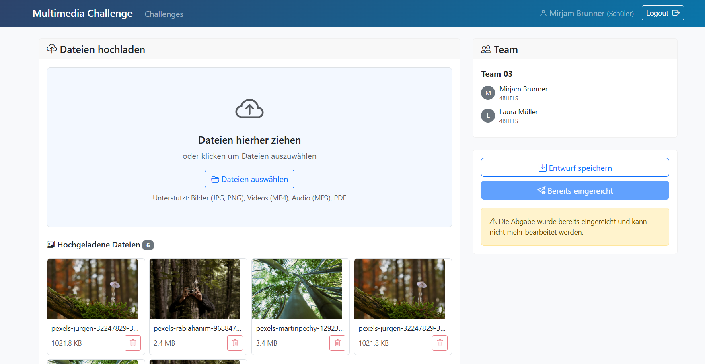

Der:die Schüler:in kann mittlerweile schon Bilder, PDF's, Videos und Audios hochladen. Diese werden strukturiert im uploads-ordner gespeichert. 

Speicherung:

1. Start: Abgabe!
2. Jahr der Challenge wird kontrolliert
3. Exestiert Ordner unter uploads mit dem Jahr als Name?
4. Wenn Schuljahr ja: Exestiert Ordner mit den Namen des Teams, dass die Challenge abgibt?
5. Wenn Team ja: Speichere die Medien in diesen Ordner
6. Wenn Schuljahr nein: EErstellt einen neuen Ordner unter uploads mit den Namen des Jahres
7. Wenn Team nein: Erstelle in dem Ordner des Jahres einen neuen Ordner mit den Namen des Teams, das die Challenge abgegeben hat.
8. Medien werden in Ordner gespeichert


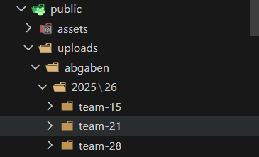

Medien, genau so wie die allgemeinen Abgaben, werden auch direkt in der Datenbank gespeichert. Sie können direkt aufgerufen werden, falls man das möchte. (z.B. bei der Bewertung bei den Lehrern)


### Abgaben verwalten und bewerten (Lehrer, Admin)

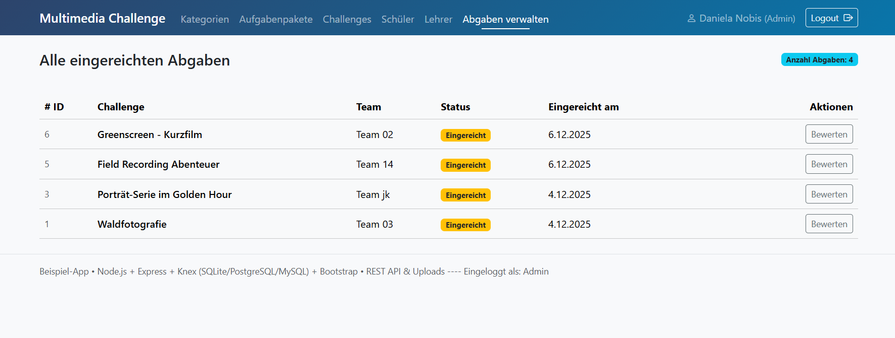

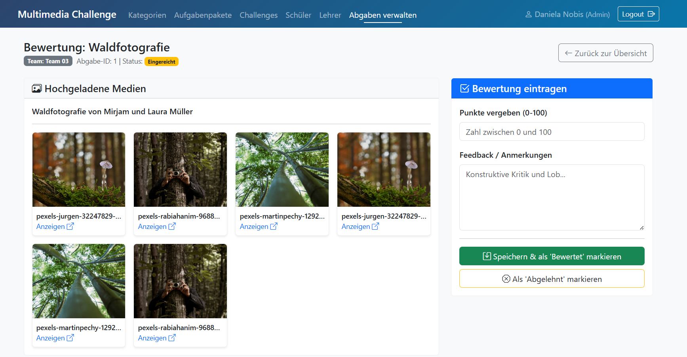


Die Lehrer und Admin sehen direkt nach der Abgabe der Schüler, die Abgaben in derer eigenen Ansicht. Sie können diese auch ansehen und bewerten. Das ist eine Funktion, die bei der normalen Medienwoche nicht notwendig ist, jedoch könnte man es in Zukunft brauchen (Punktevergabe von 0 bis 100, etc.).


## Mittwoch, 10.12.2025


### Löschen ermöglicht


#### Bei Schüler ergmöglicht
```js
app.use(methodOverride(function (req, res) {
  if (req.body && typeof req.body === 'object' && '_method' in req.body) {
    // schaut in req.body nach dem versteckten Feld _method
    const method = req.body._method;
    delete req.body._method;
    return method;
  }
}));
```

#### Bei Challenges ermöglicht


Lösung: Es wurde immer aufs Post hingeleitet und nicht aufs Delete. Das Module musste anders festgelegt werden, sodass es direkt aufs Delete zugreifen kann.

### Ansicht verbessert (Login, etc.)

**Alle:**
Das Problem war, dass wenn man localhost:3000 eingegeben hat, dass die Kategories bereits schon angezeigt worden sind, ohne dass man angemeldet ist. Das war nicht gut. Jetzt ist es so, dass man sich davor anmelden muss, bevor man etwas anderes sehen oder machen kann. 

**Schüler:**
Wenn man sich als Schüler angemeldet hat, kam man zuerst auf Kategorien. Das war nicht gut, da die Schüler eigentlich gar keinen Zugriff darauf haben dürfen. Das wurde geändert, sodass die Schüler direkt auf die Challenge Ansicht kommen, bei denen sie erwähnt worden sind. 


### Teams bearbeiten ermöglicht

Das Problem war, dass man die Challenges zwar bearbeiten konnte, jedoch konnte man nur zusätzliche Teams hinzufügen oder bestehende Teams löschen. Es hat nicht funktioniert, dass man ein Team bearbeiten kann. Diese Funktion wurde jetzt ermögliciht. Man kann ab jetzt auch Teams bearbeiten, wenn man eine Challenge bearbeitet.


### Bewertung wird bei Schüler angezeigt (Lehrer kann Bewertung abschicken)

Bis jetzt war nur möglich, dass der Lehrer/Admin die Abgabe sehen kann. Das Bewerten hat bis jetzt noch nicht funktioniert. Jetzt ist es möglich, dass der Lehrer/Admin eine Challenge bewertet (0-100 Punkte) und ein Feedback geben kann. Wenn er diese zurück schickt, wird diese Bewertung bei dem Schüler bei der Challenge angezeigt. 


**Lehrer/Admin:**

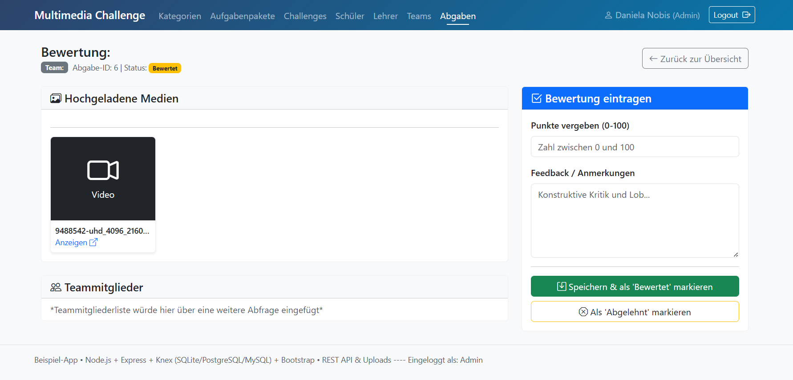


**Schüler:**
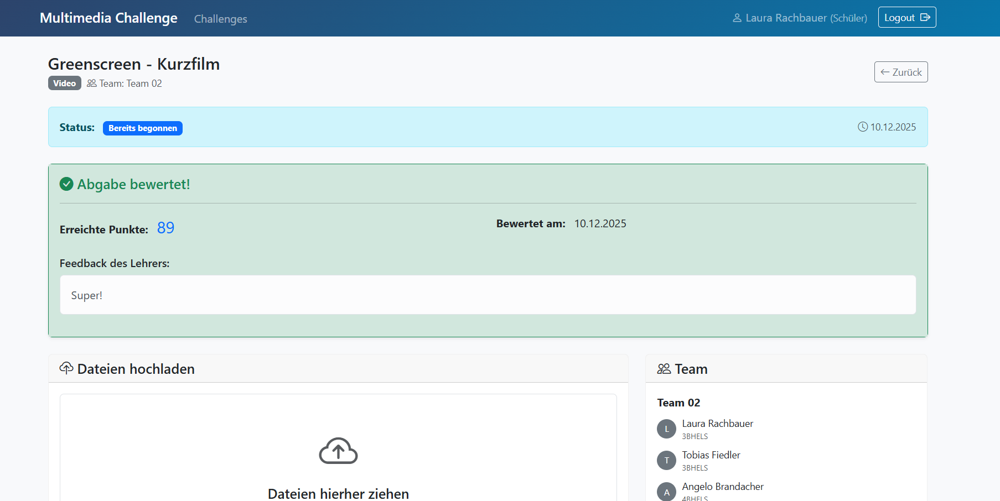


### Nächste Schritte:

- Lehrer den Challenges zuweisen??
- Sehen, wer Challenge erstellt hat?


## Donnerstag, 11.12.2025

### Akutelle Struktur

```text
  media-challenge-app/
      ├──  Datenbank/
      │   ├──  schemaDb.js
      │   └──  seedDb.js
      ├──  middleware/
      │   └──  uploads.js
      │   └──  auth.js
      ├──  node_modules/
      ├──  public/...
      ├──  routes/
      │   ├──  api/
      │   │   └──  index.js
      │   ├──  aufgabenpakete.js
      │   ├──  bewertung.js
      │   ├──  auth.js
      │   ├──  categories.js
      │   ├──  challenges.js
      │   ├──  index.js
      │   ├──  upload.js
      │   ├──  teams.js
      │   └──  schueler.js
      ├──  utils/
      │   ├──  fileHandler.js
      ├──  views/
      │   ├──  404.ejs/
      │   ├──  550.ejs/
      │   ├──  challenges/index.ejs
      │   ├──  bewertungDetail.ejs
      │   ├──  bewertungUebersicht.ejs
      │   ├──  aufgabenpakete.ejs
      │   ├──  aufgabenpaketeDetail.ejs
      │   ├──  challenges.ejs
      │   ├──  challengesDetail.ejs
      │   ├──  formAufgabenpakete.ejs
      │   ├──  formChallenges.ejs
      │   ├──  formKategorien.ejs
      │   ├──  formSchueler.ejs
      │   ├──  formLehrer.ejs
      │   ├──  index.ejs
      │   ├──  layout.ejs
      │   ├──  login.ejs
      │   └──  schueler.ejs
      ├──  .env
      ├──  .env.example
      ├──  .gitignore
      ├──  data.sqlite
      ├──  db.js
      ├──  package-lock.json
      ├──  package.json
      ├──  README.md
      ├──  reset-db.js
      └──  server.js
  ```


### Neue Struktur:

```txt
 media-challenge-app/
├──  Datenbank/
│   ├──  schemaDb.js
│   └──  seedDb.js
├──  middleware/
│   └──  uploads.js
│   └──  auth.js
├──  node_modules/
├──  public/...
├──  routes/
│   ├──  api/
│   │   └──  index.js
│   ├──  ansichten.js
│   ├──  aufgabenpakete.js
│   ├──  bewertung.js
│   ├──  auth.js
│   ├──  categories.js
│   ├──  challenges.js
│   ├──  upload.js
│   ├──  teams.js
│   ├──  lehrer.js
│   └──  schueler.js
├──  utils/
│   ├──  fileHandler.js
├──/views
|   ├── /admin/
│   ├── /challenges/
│   │   ├── challenges.ejs
│   │   ├── challengesDetail.ejs  <-- (Alt: challenges.ejs) Übersicht aller Challenges
│   │   └── formChallenges.ejs        <-- Formular (Neu/Edit)
│   │
│   ├── /bewertung/
│   │   ├── bewertungUebersicht.ejs   <-- (Alt: bewertungUebersicht.ejs)
│   │   └── bewertungDetail.ejs       <-- (Alt: bewertungDetail.ejs)
│   │
│   ├── /kategorien/
│   │   ├── kategorien.ejs
│   │   └── formKategorien.ejs
│   │
│   ├── /personen/
│   │   ├── teams.ejs
│   │   ├── lehrer.ejs
│   │   ├── schueler.ejs
│   │   ├── formLehrer.ejs
│   │   └── formSchueler.ejs
│   │
│   ├── /aufgabenpakete/
│   │    ├── aufgabenpakete.ejs
│   │    ├── aufgabenpaketeDetail.ejs
│   │    └── formAufgabenpakete.ejs
│   └── /schueler/
│       ├── /challenges/
│           ├── challenges.ejs  <-- (Alt: challenges/index.ejs)
│           └── abgabe.ejs                <-- (Alt: abgabe.ejs)
│
├──  .env
├──  .env.example
├──  .gitignore
├──  data.sqlite
├──  db.js
├──  package-lock.json
├──  package.json
├──  README.md
├──  reset-db.js
└──  server.js   
```


## Donnerstag, 18.12.2025


### Ziel des Tages

Das Projekt muss auf eine Version zurückgesetzt werden, dort wo der Code noch übersichtlich und verständlich war. Es können und werden dabei Funktionen verloren gehen. Das Ziel ist der Wiederaufbau des Projekts durch übersichtliche Codierungsschritte.


### Vorgangsweise:

- Eventuell Suchfilter Funktion einmal machen und dann immer anwenden.


### Funktionen der Website

#### Darstellung auf A3 Zettel und Adobe Experience Design

**Ziel:** Wir müssen alle Funktionen übersichtlich darstellen, sodass wir unsere Arbeiten gut durchführen können.

Wenn die **Funktionen fertig** sind, werden diese an die **Frontend-Entwicklung weitergegeben**. Wir arbeiten uns jetzt immer Schritt für Schritt und Seite für Seite vor, damit wir einen guten Arbeitsbereich schaffen und Fortschritte erzielen. Wir müssen einige **Versionen zurückgehen**, um den jetzigen Code wieder zu reparieren und **übersichtlicher** zu machen. 

Die nächste Herrausvorderung ist, die **komplette Übersicht** von der ganzen Website und Funktionen fertig zu stellen und den Stand von der aktuellen Website zurückzusetzen und **neu aufzubauen**.  

**Zettel:**


**XD:**

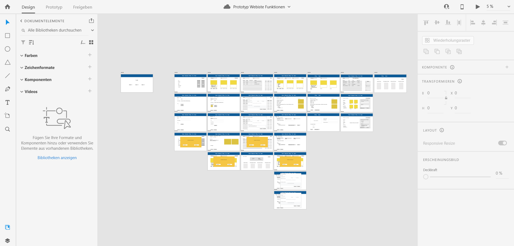


## Samstag, 27.12.2025

### Neue Struktur:

```txt
media-challenge-app/
├── Datenbank/                  # Skripte für Tabellen-Setup und Testdaten
│   ├── schemaDb.js
│   └── seedDb.js
├── middleware/                 # Prüfungen (Login, Rollen, Upload-Validierung)
│   ├── auth.js
│   └── uploads.js
├── public/                     # Statische Dateien (CSS, Bilder, JS-Logik)
│   ├── css/
│   │   └── custom/             # Deine ausgelagerten Styles (z.B. abgabeStyles.css)
│   ├── js/
│   │   └── app/                # Deine ausgelagerte Logik (z.B. abgabeLogic.js)
│   └── uploads/                # Speicherort für hochgeladene Schüler-Dateien
├── routes/                     # Die "Verkehrspolizei" (Routen-Logik)
│   ├── api/
│   │   └── index.js            # API-Endpunkte für Fetch-Requests
│   ├── ansichten.js            # Haupt-Router (ehemals index.js)
│   ├── aufgabenpakete.js
│   ├── auth.js
│   ├── bewertung.js
│   ├── categories.js
│   ├── challenges.js
│   ├── lehrer.js
│   ├── schueler.js
│   ├── teams.js
│   └── upload.js
├── utils/                      # Hilfsfunktionen
│   └── fileHandler.js          # Logik zum Löschen/Verschieben von Dateien
├── views/                      # EJS-Templates (UI)
│   ├── admin/                  # LEHRER- & ADMIN-BEREICH
│   │   ├── aufgabenpakete/
│   │   │   ├── aufgabenpakete.ejs
│   │   │   ├── aufgabenpaketeDetail.ejs
│   │   │   └── formAufgabenpakete.ejs
│   │   ├── bewertung/
│   │   │   ├── bewertungDetail.ejs
│   │   │   └── bewertungUebersicht.ejs
│   │   ├── challenges/
│   │   │   ├── challenges.ejs
│   │   │   ├── challengesDetail.ejs
│   │   │   └── formChallenges.ejs
│   │   ├── kategorien/
│   │   │   ├── formKategorien.ejs
│   │   │   └── kategorien.ejs
│   │   └── personen/
│   │       ├── formLehrer.ejs
│   │       ├── formSchueler.ejs
│   │       ├── lehrer.ejs
│   │       ├── schueler.ejs
│   │       └── teams.ejs
│   ├── schueler/               # SCHÜLER-BEREICH
│   │   └── challenges/
│   │       ├── abgabe.ejs
│   │       └── challenges.ejs
│   ├── layout.ejs              # Das Grundgerüst (Navbar, Footer, Bootstrap)
│   └── login.ejs               # Login-Seite
├── .env                        # Geheimnisse (Datenbank-Pfad, LDAP-Konfig)
├── .gitignore                  # Was nicht zu GitHub soll (node_modules, uploads)
├── db.js                       # Knex-Konfiguration / DB-Verbindung
├── package.json                # Liste aller installierten Pakete
├── server.js                   # Das Herzstück (App-Start)
└── data.sqlite                 # Deine tatsächliche Datenbank-Datei

```

### Änderungen

- Ich habe einen neuen Branch am aktuellsten Stand erstellt, da alles funktioniert und ich da weiter arbeiten möchte. 
- Ich habe angefangt, den Code zusammenzuräumen. 
- Der erste Schritt war, dass ich ein paar kleine Änderungen als Verbesserung vornehmen musste (löschen von Dateien der Schüler). 
- Der nächste Schritt war, dass ich alle ``<script>``'s aus den .ejs Dateien entferne und in ein extra .js File einpacke. 
- Diese befinden sich in public/js/app/*hier befinden sich die Files*. 
- Das Ziel ist es, dass nachdem man die scripts, etc von einander getrennt hat, dass man ein gemeinsames Partial erstellen kann, dass für mehrere Seiten verwendet werden kann (Suchfunktionen, Filterfunktionen, etc.)

Warum haben wir nicht auf eine ganz alte Version gewechselt?
- Eigentlich war der Plan, dass wir einge Versionen zurück gehen. Da aber alles grundsätzlich funktioneirt und wir nur die Strukturierung, das Wissen und die Organisation wieder in einen guten Zustand bringen müssen, arbeiten wir mit der aktuellen Version in einem eigenen Branch weiter, damit wir mit der jetzigen Datenbankstruktur und mit den bereits vorhandenen Funktionen weiterarbeiten können. Wenn unser Branch in einer finalen Verfassung ist, werden wir diesen dann wieder zu unserem neuen 'Main' machen.


Bis jetzt wurden folgende ```<scripts>``` 's schon bearbeitet:
- aufgabenpaketeLogic.js
- challengesLogic.js
- LehrerList.js
- schuelerList.js

Was auch noch gemacht werden muss (auser scripts):
- formChallenges.ejs, etc. zu challengeForm.ejs umbenennen (für bessere Übersicht)
  - kommt öfter vor --> überall ändern!!


## Sonntag, 04.01.2026

### Ziel für heute:

- Die zuletzt angefangte Version fertigstellen und die restliche Logik trennen von den .ejs Dateien
- Partial entwickeln, damit man Codes mehrfach nutzen kann (suchen, filtern,...)


#### Partials:

- Für welche Bereiche sind sie besonders gut geeignet?
  - Karten/Zeilen-Layouts
  - Modale & Bestätigungs-Dialoge
  - Filterleisten/Suchzeilen

  --

  --

- **1.Partial für Löschmodal**
```js
 <%- include('../../partials/deleteModal', {
        modalId: 'confirmDeleteModal',
        formId: 'deleteConfirmFormChallenge',
        submitButtonId: 'confirmDeleteSubmitChallenge',
        title: 'Löschen bestätigen',
        bodyText: 'Bist du sicher, dass du diese Challenge löschen möchtest?'
      }) %>
```
Diesen Code integriert man in jedes .ejs File, wo man die Löschfunktion benötigt.
Der richtige Lösch-EJS Code befindet sich ab sofort in einem partial "deleteModal.ejs"


- **2.Partial für Kategorie Ansichten: Challenges und Aufgabenpakete (intern)**

Anzeige der Challenges und Aufgabenpakete in ein eigenes Partial unter der jeweiligen Ordner verschoben.


- **3.Partial für Kategorie (Filter) + Suche**


--- 
- Challenge erstellen geht nicht!!! (Teams hinzufügen --> danach kann man nichts mehr machen!!)


---


#### Mit Laura zusammen reden:
- Alte Versoin zum weiterarbeiten finden. 
- Funktionen von Grund auf wieder aufbauen, damit ich zuerst die Funktionen und sie das Frontend machen kann. 


## Montag, 05.01.2025


### Neue Struktur:

```txt
media-challenge-app/
├── Datenbank/                  # Skripte für Tabellen-Setup und Testdaten
│   ├── schemaDb.js
│   └── seedDb.js
├── middleware/                 # Prüfungen (Login, Rollen, Upload-Validierung)
│   ├── auth.js
│   └── uploads.js
├── public/                     # Statische Dateien (CSS, Bilder, JS-Logik)
│   ├── css/
│   │   └── custom/             # Ausgelagerten Styles (z.B. abgabeStyles.css)
│   ├── js/
│   │   └── app/                # Deine ausgelagerte Logik (z.B. abgabeLogic.js)
│   │         ├── utils/
│   │         │     ├── deleteModalUtils.js
│   │         │     └── filterUtils.js
│   │         ├── abgabeLogic.js
│   │         ├── aufgabenpaketeFormLogic.js
│   │         ├── aufgabenpaketeLogic.js
│   │         ├── bewertungDetailLogic.js
│   │         ├── bewertungUebersichtLogic.js
│   │         ├── categoriesLogic.js
│   │         ├── challengesFormLogic.js
│   │         ├── challengesLogic.js
│   │         ├── teamsLogic.js
│   │         ├── teamModalLogic.js
│   │         ├── lehrerList.js
│   │         └── schuelerList.js 
│   │      
│   └── uploads/                # Speicherort für hochgeladene Schüler-Dateien
├── routes/                     # Die "Verkehrspolizei" (Routen-Logik)
│   ├── api/
│   │   └── index.js            # API-Endpunkte für Fetch-Requests
│   ├── ansichten.js            # Haupt-Router (ehemals index.js)
│   ├── aufgabenpakete.js
│   ├── auth.js
│   ├── bewertung.js
│   ├── categories.js
│   ├── challenges.js
│   ├── lehrer.js
│   ├── schueler.js
│   ├── teams.js
│   └── upload.js
├── utils/                      # Hilfsfunktionen
│   └── fileHandler.js          # Logik zum Löschen/Verschieben von Dateien
├── views/                      # EJS-Templates (UI)
│   ├── admin/                  # LEHRER- & ADMIN-BEREICH
│   │   ├── aufgabenpakete/
│   │   │   ├── card.ejs
│   │   │   ├── aufgabenpakete.ejs
│   │   │   ├── aufgabenpaketeDetail.ejs
│   │   │   └── formAufgabenpakete.ejs
│   │   ├── bewertung/
│   │   │   ├── bewertungDetail.ejs
│   │   │   └── bewertungUebersicht.ejs
│   │   ├── challenges/
│   │   │   ├── card.ejs
│   │   │   ├── challenges.ejs
│   │   │   ├── challengesDetail.ejs
│   │   │   └── formChallenges.ejs
│   │   ├── kategorien/
│   │   │   ├── formKategorien.ejs
│   │   │   └── kategorien.ejs
│   │   └── personen/
│   │       ├── formLehrer.ejs
│   │       ├── formSchueler.ejs
│   │       ├── lehrer.ejs
│   │       ├── schueler.ejs
│   │       └── teams.ejs
│   ├── schueler/               # SCHÜLER-BEREICH
│   │   └── challenges/
│   │       ├── abgabe.ejs
│   │       └── challenges.ejs
│   ├── partials/               # PARTIALS-BEREICH
│   │       ├── deleteModal.ejs
│   │       ├── teamModal.ejs
│   │       └── filter_search.ejs
│   ├── layout.ejs              # Das Grundgerüst (Navbar, Footer, Bootstrap)
│   └── login.ejs               # Login-Seite
├── .env                        # Geheimnisse (Datenbank-Pfad, LDAP-Konfig)
├── .gitignore                  # Was nicht zu GitHub soll (node_modules, uploads)
├── db.js                       # Knex-Konfiguration / DB-Verbindung
├── package.json                # Liste aller installierten Pakete
├── server.js                   # App-Start
└── data.sqlite                 # Test-Datenbank

```

## Donnerstag, 08.01.2026


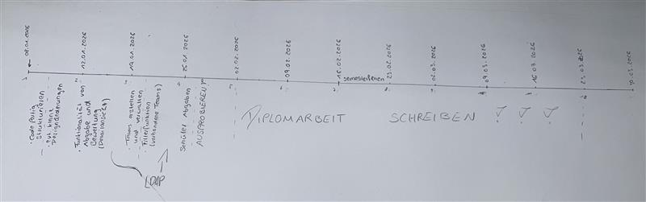


### Ziel für heute:

Zeitstrahl entwerfen!
- für die nächsten 12 Wochen
- Diplomarbeit schreiben miteinplanen (siehe Bild oben)

Partials für Logic-.js Files:
- Filtern
  - Kategorie
  - Schuljahr
  - Suche
  - "keine Ergebnisse"
  - Delete-Modal


  Wenn man Challenge löscht, werden angebundene Teams auch gelöscht!

  Muss noch geändert werden.


### Delete-Util --> Aufruf in Logik

  ```js
   // Delete Modal -> PARTIAL
    initDeleteModal({
    modal: deleteModal,
    form: deleteForm,
    submitBtn: confirmDeleteSubmit,
    buildAction: (id) => `/challenges/${id}?_method=DELETE`
    });
  ```


  ### Live-Suche-Util --> Aufruf in Logik

  ```js
   // NEU: Suche über FilterUtils
    FilterUtils.initSearchWithBadge({
        input: searchInput,
        badge: searchBadge,
        textSpan: searchTermText,
        onChange: () => applyFilters()
    });
  ```


  ### LDAP Daten

  IM HTL WLAN:

  - media-challenge.htl-braunau.at


  ## Montag, 12.01.2026


  ### Ziele:

  - Upload/Bewerten weiterbearbeiten
  - Besser strukturieren und Versuche Durchführen


  Laura muss umbedingt Challenges erstellen Problem fixen!! weil sonst kann man keine neuen Challenges erstellen. 


  ### Damit komme ich zu "Abgabe einreichen" Seite:

  ```js
  <!-- Nur für Lehrer/Admin: Bearbeiten -->
              <% if (currentUser && currentUser.user_role_id !== 1) { %>
                <div class="btn-group">
                  <a href="/challenges/<%= challenge.id %>/edit" class="btn btn-outline-primary btn-sm">Bearbeiten</a>
                  <form action="/challenges/<%= challenge.id %>?_method=DELETE" method="POST" class="d-inline">
                    <button type="submit" class="btn btn-outline-danger btn-sm">Löschen</button>
                  </form>
                </div>
              <% } %>
  ```

  ## Dienstag, 13.01.2026

  ### Überlegungen:

  Javascript - Files (zb Challenges), wo auch Codes für die Schüler-.ejs Files vorkommen, trennen unter Schüler und Lehrer/Admin. ---> bessere Wartbarkeit 


  ## Donnerstag, 15.01.2026

### Ziel: 
  - Wenn man Challenge löscht, werden angebundene Teams auch gelöscht! Muss noch geändert werden.

  - Challenges erstellen Problem fixen!! weil sonst kann man keine neuen Challenges erstellen. 


### Noch machen

- Infos von Schüler - Bewertung bei Lehrer anzeigen lassen

- Challenges löschen funktioniert nicht ( Challenges Details)

- Benachrichtigungen für Schüler


## ------NOCH EINIGE TAGE NACHSCHREIBEN

## Mittwoch, 21.01.2026

- Teams im Teams.ejs Fille erstellen und verwalten

## Samstag, 24.01.2026

Projektmanagement: Plichtenheft Endversion und Jahresüberblick-Aktualisierung

## Montag, 26.01.2026

### Ziel für heute:
- Teams bearbeiten
- Teams erstellen
- Teams Live-Suchen
- Teams in ChallengesForm miteinbinden, damit schon bereits vorhandene Teams ausgewählt werden können.
  - Das muss noch ausgearbeitet werden!! Das funktioniert noch nicht.


### Problem:

Ich habe jetzt zwei Modals für Team erstellen
- 1. In teamModal.ejs und teamModalLogic.js
- 2. challengesFormLogic.js und challengesForm.ejs GLAUBE ICH

Ich muss aufpassen, dass ich das berücksichtige und schnellstmöglich ändere, bevor ein Chaos entsteht und Daten falsch gespeichert werden. 

### Lösung:

Ein Team-Modal für beide Anwendungen --> Die best-mögliche Lösung und eigentlich auch die einzige Lösung ist, dass man das gleiche Modal immer wieder verwendet.

Ich habe auch schon ein Modal erstellt. Ich muss jetzt nur noch schauen, wie und ob ich es in ChallengesForm ohne große Probleme integrieren kann. Das ist das Ziel fürs nächste mal.


## Donnerstag, 29.01.2026

### Wichtig
- Daten bis nur 100 MB sollen hochgeladen werden können.
- Große Videos gegebenfalls mit Link von Youtube hochladen


### Ziel von heute:
- Modal anpassen und Partials bilden. Wie geht man am besten vor?
- Wenn ich beim Challenge erstellen drin bind und ein bereits vorhandenes Team auswähle. Was passiert, wenn ich auf bearbeiten drücke? --> **WELCHES MODAL WIRD AUFGERUFEN?**
- ZWEI MODALS? --> Nicht gut !!! müssen wir noch ändern
  - Wenn man unter TEAMS Team Modal benutzt und auf Team erstellen drückt, wird Team direkt gepseichert
    - Wenn man das im Challenge-Team Bereich so macht und auf Team erstellen drückt, wird es erst noch nicht gespeichert. Es wird erst gespeichert, wenn man auf Challenge speichern drückt!!

DAS IST DER UNTERSCHIED !! Muss noch geregelt werden

Ziel ist, dass nur ein Modal exisitiert zum Team erstellen. Und nicht zwei. das wäre wichtig. --> dabei muss das team modal von der challengesForm Seite komplett gelöscht oder halt mit include eingebunden werden. !! das wäre mal der grundlegende Plan


Weiteres Problem
- challengesForm.js ist noch VIEEEL zu lange!! Es müssen entweder Partials gemacht werden oder wir verwenden da ebenso die teamsModalLogic.js, die wir beim Teams-part auch hernehmen !!! Da müssen wir aber auch wieder auf den Part mit dem Speichern achten. Wichtig!

- Wenn man eine Challenge löscht, wird auch direkt das dazugehörige Team auch gelöscht. --> nicht gut!
  - muss geändert werden

### Erreicht: 
  - Teams-Modal-Partial erstellt. Das wird für alle Anwendungen hergenommen. Verwalten und Wiederverwendunge der Daten versichert.


  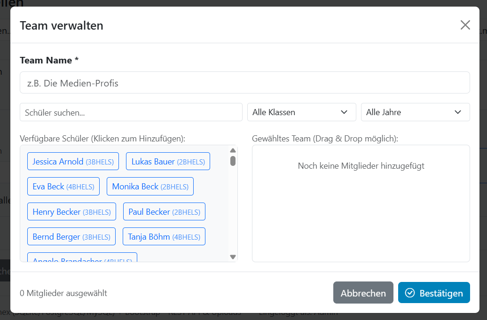

- Neues Team-Modal
- Es werden wieder Schüler von Datenbank angezeigt. Filtern,etc. ist noch nicht möglich/ nicht mehr.
  - Muss wieder deklariert werden
- Kein Drap and Drop mehr - Nur noch ganz einfach mit ankicken.


--> ERFOLG:
- Das gleiche Partial wird für Challenges-Team erstellen und für normal Team erstellen hergenommen.


### Probleme: 

Das größte Problem war, dass das Modal nicht komplett geschlossen hat, wenn man unter "Challenge erstellen" ein Team erstellen wollte.

Es wurde alles grau und der Bildschirm ist "eingestarrt" 

Woran liegt das?
- Das Modal hat geschlossen, während die erstellen Teams in einer Liste gespeichert wurden. Diese zwei Aktivitäten "hetzten" sich gegenseitig auf und kollidierten. Das Team wurde zwar in der Liste gespeichert und auch aufgelistet, jedoch hat sich das Modal wie gesagt nicht komplett geschlossen

### Lösung:

Es lag an einigen Programmschnippseln am Programm!

1. Der handler im teamModalLogic.js:

```js
handleSave() {
        const members = Array.from(this.dropZone.querySelectorAll('[data-id]')).map(el => ({
            id: el.dataset.id,
            vorname: el.dataset.vorname,
            nachname: el.dataset.nachname,
            klasse: el.dataset.klasse
        }));
        const name = this.nameInput.value.trim();

        if (!name || members.length === 0) {
            alert("Bitte Name und Mitglieder eingeben!");
            return;
        }

        // 1. Modal-Instanz holen und schließen
        const modalInstance = bootstrap.Modal.getOrCreateInstance(this.modalElement);
        modalInstance.hide();

        // 2. DER STARRE-BRECHER (Timeout)
        // Wir warten, bis die Animation fast fertig ist
        setTimeout(() => {
            // Daten erst JETZT speichern, um DOM-Konflikte zu vermeiden
            this.onSave({ name, members });

            // RADIKAL-REINIGUNG: Wir löschen alles, was das Scrollen blockiert
            document.body.classList.remove('modal-open');
            document.querySelectorAll('.modal-backdrop').forEach(el => el.remove());

            // CSS-Eigenschaften manuell zurücksetzen
            document.body.style.overflow = 'auto';
            document.body.style.paddingRight = '0px';

            console.log("Scroll-Sperre manuell aufgehoben.");
        }, 350);
    }
```

2. Init:

```js
 init() {
        // Event Listener für Filter (Suchen & Klasse)
        this.nameFilter?.addEventListener('input', () => this.renderAvailable());
        this.classFilter?.addEventListener('change', () => this.renderAvailable());

        // Speichern-Button
        this.submitBtn?.addEventListener('click', (e) => {
            e.preventDefault();
            this.handleSave();
        });

        // Cleanup-Logik wenn das Modal geschlossen wird
        this.modalElement.addEventListener('hidden.bs.modal', () => {
            this.cleanup();
        });
    }
```

UND DAS ENTSCHEIDENDE:
- Im Style wurde das Problem bekämpft - Dort wurden die Eigenschaften auf *important* gesetzt. Das hilft dabei, dass das Modal wieder ordnungsgerecht geschlossen wird.  

```css
<style>
    /* Die Lebensversicherung: Scrollen immer erlauben und Starre verhindern */
    body.modal-open {
        overflow-y: auto !important;
        padding-right: 0 !important;
    }
    body {
        overflow-y: scroll !important;
    }
    .cursor-pointer { cursor: pointer; }
</style>
```


## Freitag, 30.01.2026

### LDAP Daten:

- Ich habe die ENV Daten zu meinen bisherigen Daten hinzugefügt. (Ins .env und ins .env.example)

- Ich habe ein Beispiel-.js erstellt, damit ich testen kann, ob ich die Daten von dieser Datenbank holen kann. Es funktioniert!!!
  

### Ziel von heute:

Team erstellen und verwalten finalisieren.:


#### Challenges - Teams verwalten

- Team NEU erstellen unter Challenges:

  - Wenn man eins neu erstellt, wird es zwar gut gespeichert, aber die Mitglieder werden bei der Challenges-Übersicht nicht angezeigt. Der Team - Name aber schon.


- VORHANDENES Team hinzufgügen zu Challenges:

  - Wenn man ein vorhandenes Team auswählt, kann man es zwar auswählen, aber wenn man auf speichern drückt und auf die Challenges Ansicht geht, wird angezeigt, das kein Team zugewiesen ist. Quasi es wird nichts angezeigt.
  - Es wird auch nicht in der Datenbank gespeichert also es wird das Team nicht mit der Challenge noch nicht verknüpft. muss noch geändert werden.


- Teams speichern bzw Mitglieder mitspeichern

  - Wenn man ein Team erstellt wird zwar der Name gespeichert, aber nicht die Mitglieder, die ich mit ausgewählt habe beim Team Modal im Challenges Bereich. Bei der offiziellen Teams-Übersicht wird dann auch nur der Team-Name angezeigt, aber nicht die Mitglieder. Das ist nicht gut
  - Beim Teams-Bereich also quasi im Offiziellen beim Modal passiert das nicht. Da funktioniert eigentlich alles ziemilch gut. 


- Wenn man ein Team im Challenges -Bereich erstellt also quasi neu:
  - Wenn man auf "Team hinzufügen" drückt wird das Team zwar auch zur Liste quasi hinzugefügt, aber leider sogar zweimal!! also Im Challenges.-Erstellbereich wird dann zwei mal das gerade eben erstellte Team angezeigt. Das ist nicht gut. Und eben Mitglieder werden nicht mitgespeichert, wenn man auf gesamte Challenge speichern drückt wie gehabt. 

### Weiteres (Probleme)

- Weiteres PROBLEM - Overlay (grau) nach "Abbrechen":

  - Wenn man auf das team Modal geht und auf abbrechen drückt, kommt wieder das graue overlay. Es geht aber erst wieder weg, wenn man oben auf die Leiste drückt und auf Enter. Quasi man "lädt" die Seite "neu". Dann gehts weg. Woran liegt das?


- Filtern von Schülern bei Teams Modal (beide)

  - Filtern funktioniert noch nicht richtig bei beiden Anwendungen der Modale. Das muss noch gefixt werden.


### Heute geschafft:

- Team Modal:
  - Graues Overlay funktioniert jetzt! Mit der CSS Logik ist es jetzt möglich, dass sich das TeamModal ordnungsgerecht schließt und öffnet (mit grauen Overlay)


- Es geht jetzt alles, was heute davor noch nicht funktioniert hat! 

### Ziel für Zukunft:

- LDAP Daten gut eintragen (Schüler, Lehrer ev.)
- Login für Schüler (echte Schüler) ermöglichen
- **Fragen, wie ich zuhause mit den LDAP Daten arbeiten soll, wenn das nur über das Schüler Wlan geht.**
- Datenbankänderungen eventuell vornehmen und Website daran anpassen. 


 ## Mittwoch, 04.02.2026:

 LDAP-Brücke steht: Der Login mit echten Schulkürzeln funktioniert.

Datenbank-Sync: Deine users-Tabelle füllt sich automatisch mit echten Klassen.

Schnell-Login repariert: Kein "Zufalls-Login" mehr, sondern gezielte Test-User für Schüler (1) und Admin (3).

Statistik-Aura: Dein Lehrer-Dashboard zeigt jetzt minimalistisch und übersichtlich die importierten Klassen an.

### Heute geschafft: 

1. Server-Infrastruktur & LDAP-Integration
    - LDAP-Anbindung: Erfolgreiche Konfiguration des LDAP-Services zur Authentifizierung von Schülern und Lehrern über den schulinternen Server.

    - Fehlertoleranz im Home-Office: Implementierung einer Weiche im Login-Prozess, die bei fehlender VPN-Verbindung zum Schulnetzwerk automatisch auf lokale Test-User umschaltet, um die Entwicklung zu Hause zu ermöglichen.

    - Daten-Synchronisation: Programmierung einer Logik, die beim ersten Login via LDAP die Benutzerdaten (Vorname, Nachname, Kürzel) automatisch in die lokale MariaDB-Datenbank übernimmt.

2. Datenbank-Optimierung & User-Management
    - Klassen-Zuordnung: Umstellung der Datenbank-Abfragen auf ein dynamisches Modell, bei dem die Klasse eines Schülers direkt über die klasse_id aus der klassen-Tabelle aufgelöst wird.

    - Statistik-Modul: Entwicklung einer SQL-Abfrage, die importierte Schüler nach Klassen gruppiert zählt, um dem Admin eine Übersicht über den Importstatus zu geben.

    - Quick-Login System: Erweiterung der auth.js um eine robuste LIKE-Suche, damit Test-Accounts auch bei unvollständigen Namenseingaben sofort eingeloggt werden können.

3. Challenge- & Abgabe-System (Backend & Logic)
    - Upload-Infrastruktur: Erstellung einer dynamischen Ordnerstruktur für Abgaben, die Dateien nach Schuljahr und Team-ID sortiert (z.B. /uploads/abgaben/2025-26/team-15/).

    - Abgabe-Bugfix: Behebung eines JavaScript-Fehlers in der abgabeLogic.js, der das Absenden von Challenges verhinderte (Zugriff auf ein nicht existierendes Titelfeld wurde entfernt).

    - Fortschritts-Algorithmus: Implementierung einer Logik in EJS, die den Team-Fortschritt in Prozent berechnet, basierend auf dem Status der zugewiesenen Challenges (offen, eingereicht, bewertet).

4. Frontend-Design & User Experience (UX)
    - Admin-Dashboard: Umzug der Klassen-Statistiken von der Kategorien-Seite zur Schüler-Übersicht für eine bessere kontextuelle Trennung.

    - Team-Detailansicht: Neugestaltung der Detailseite mit einem modernen Header, einem dedizierten "Zurück"-Button und einer übersichtlichen Aufteilung in Teammitglieder (links) und Challenge-Status (rechts).

    - Editor-Setup: Korrektur der VS Code Sprachzuordnungen für .ejs-Dateien, um korrektes Syntax-Highlighting im HTML-Stil ohne Fehlermeldungen zu gewährleisten.


## Donnerstag, 05.02.2026

    Erklärung: /routes/api/index.js:
      - Unterscheidung zwischen clientseitigem Filtern (filterUtils.js) für schnelle UI-Interaktionen und serverseitiger API-Suche (api/index.js) für umfassende Datenbankabfragen implementiert.


### VPN installieren: 
      https://www.fortinet.com/support/product-downloads

      --> müssen wir noch machen, macht Herr Hanl mit uns. 


## Mittwoch, 11.02.2026

Die Schüler sollen die Filme (falls Kategorie Filmproduktion) auch als Link abgeben können (Youtube). Durch diese Lösung kann eine große Menge an Speicherplatz gespart werden und dabei werden auch nicht die vorgegebenen 100 MB überschritten. Das ist eine effiziente neue Lösung für die Zunkunft. Explizit auch für die Medienwoche! (Schüler laden deren Film direkt privat auf Youtube hoch)

Was noch zu machen ist:
- Ein Zeichen bei den Challenges der Schüler, ob Challenge bereits bewertet wurde oder nicht
- Bei der Team-Detail Seite den Ansicht-Button funktionabel machen.
- Link-Funktion hinzufügen (Video-Abgabe)


Nice to have:
- Sqlite: 1, 2, 3 Login bei sqlite machen
  - (geht bis jetzt nur 1 und 2)
- Sqlite: Lehrerdaten und Schülerdaten trennen --> Lehrer zur Lehrerseite


### Challenges -> Status
- funktioniert!

### Video-Link speichern

- Dateien (Bilder/Uploads): Landen im Ordner (Uploads) + Pfad in der DB (abgabe_medien).
  - Dateien für alles, was ihr selbst erstellt habt (Bilder, Dokumente).

- Video-Link: Landet nur als Text in der Spalte video_link der Tabelle challenge_abgaben.
  - Links für alles, was zu groß ist (YouTube-Videos), damit euer Server nicht voll wird.

  Es funktioniert! Das Video kann per Link vom Schüler hochgeldaden werden. Bei der Lehreransicht (bewerten) wird das Video direkt auf der eigenen Website angezeigt! Der Vorgang ist so:


  ```html
  <% if (abgabe.video_link) { %>
  <div class="col-12 mb-4">
    <div class="card shadow-sm border-primary">
      <div class="card-header bg-primary text-white d-flex justify-content-between align-items-center">
        <span><i class="bi bi-youtube me-2"></i> Eingebettetes Video</span>
        <a href="<%= abgabe.video_link %>" target="_blank" class="btn btn-light btn-sm">
          <i class="bi bi-box-arrow-up-right"></i> Im neuen Tab öffnen
        </a>
      </div>
      <div class="card-body p-0">
        <% 
          // Logik um YouTube ID zu extrahieren
          let videoSrc = abgabe.video_link;
          let isYouTube = false;
          const ytMatch = abgabe.video_link.match(/(?:https?:\/\/)?(?:www\.)?(?:youtube\.com\/watch\?v=|youtu\.be\/)([^\s&]+)/);
          
          if (ytMatch) {
            videoSrc = `https://www.youtube.com/embed/${ytMatch[1]}`;
            isYouTube = true;
          }
        %>

        <% if (isYouTube) { %>
          <div class="ratio ratio-16x9">
            <iframe src="<%= videoSrc %>" title="YouTube video player" frameborder="0" 
                    allow="accelerometer; autoplay; clipboard-write; encrypted-media; gyroscope; picture-in-picture" 
                    allowfullscreen></iframe>
          </div>
        <% } else { %>
          <div class="p-4 text-center">
            <i class="bi bi-link-45deg fs-2"></i>
            <p>Externer Link erkannt: <a href="<%= abgabe.video_link %>" target="_blank"><%= abgabe.video_link %></a></p>
            <p class="small text-muted">Vorschau für diesen Anbieter nicht verfügbar.</p>
          </div>
        <% } %>
      </div>
    </div>
  </div>
<% } %>

Um das Video direkt anzeigen lassen zu können bei der Bewertung, muss der Link verändert werden! (embed)

```js
<% 
          // Logik um YouTube ID zu extrahieren
          let videoSrc = abgabe.video_link;
          let isYouTube = false;
          const ytMatch = abgabe.video_link.match(/(?:https?:\/\/)?(?:www\.)?(?:youtube\.com\/watch\?v=|youtu\.be\/)([^\s&]+)/);
          
          if (ytMatch) {
            videoSrc = `https://www.youtube.com/embed/${ytMatch[1]}`;
            isYouTube = true;
          }
 %>
```

Wenn man auf "im neuen Tab öffnen" drückt, wird es direkt in Youtube geöffnet. Da wird der normale Youtube-Link aufgerufen.

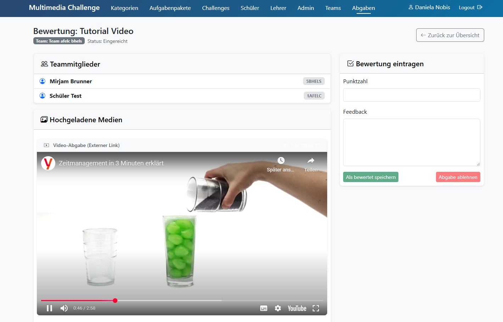
  


Eventuell für Zukunft:
- Lehrer für Kategorien zuteilen! (Damit nicht jeder alle Challenges von allen Lehrern sieht)