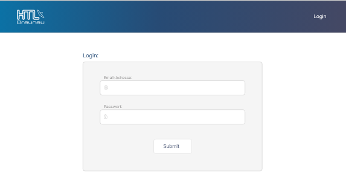
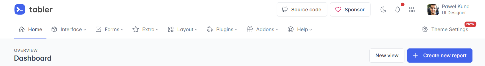
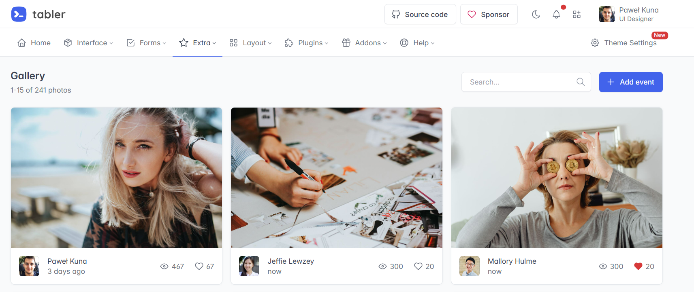

# Projekttagebuch

## Donnerstag 18.09.2025
 
 **ABA Portal**

 - Fertigstellung des ABA Portals
 - Einreichung abgeschlossen

 **Website Prototyp mit TablerIO**

  - Erstellung eines Website-Prototypen mithilfe von Tabler.Io
  - Klare Seitenstruktur (Navigation, Startseite, Unterseiten)
  - Erste visuelle Umsetzung des geplanten Designs

**Eigene Designs:**
 > 

 > 

 > 

 **TablerIO Inspirationen:**

 > 

 > 

 >  
 

**Probleme**

 - Die Auswahl von Farben, Designs und Icons fiel mir nicht immer leicht. 

 **Quellen**

  - https://tabler.io/ 
  - https://fonts.google.com/icons

## Donnerstag 25.09.2025

 - Krank!