# Funktionen der Website

## Darstellung auf A3 Zettel und Adobe Experience Design

**Ziel:** Wir müssen alle Funktionen übersichtlich darstellen, sodass wir unsere Arbeiten gut durchführen können.

Wenn die **Funktionen fertig** sind, werden diese an die **Frontend-Entwicklung weitergegeben**. Wir arbeiten uns jetzt immer Schritt für Schritt und Seite für Seite vor, damit wir einen guten Arbeitsbereich schaffen und Fortschritte erzielen. Wir müssen einige **Versionen zurückgehen**, um den jetzigen Code wieder zu reparieren und **übersichtlicher** zu machen. 

Die nächste Herrausvorderung ist, die **komplette Übersicht** von der ganzen Website und Funktionen fertig zu stellen und den Stand von der aktuellen Website zurückzusetzen und **neu aufzubauen**.  

**Zettel:**

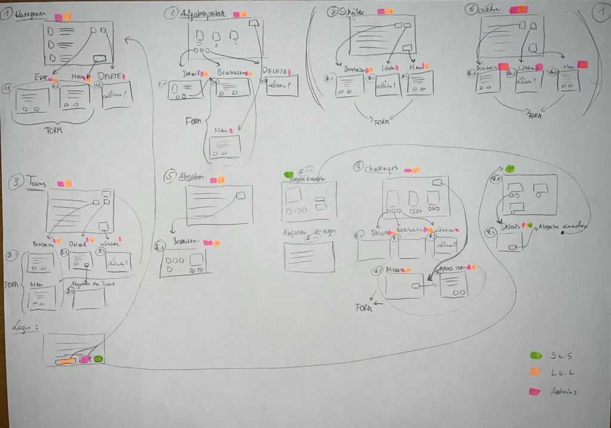

**XD:**

## Welche Funktionen/Ansichten durchgehend gleich bleiben:

- Löschen Pop Up: "Möchtest du wirklich löschen?"
- Such-Funktion
- Filter-Funktion

## 1. Kategorien

**Funktionen:**

Es müssen folgende Funktionen vorhanden sein:
- Übersicht aller Kategorien
- Bearbeiten einer Kategorie
- Löschen einer Kategorie
- Erstellen einer neuen Kategorie

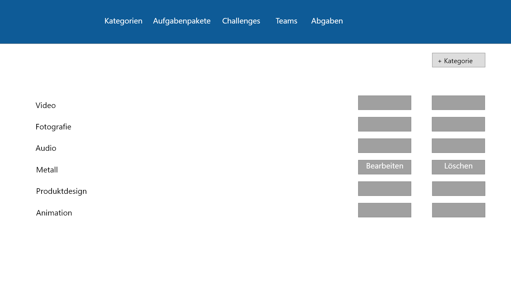

### Neue Kategorie erstellen/bearbeiten:

Es müssen folgende Funktionen vorhanden sein:
- Titel von Kategorie angeben
- Beschreibung der Kategorie angeben
- Ein Icon/Bild hochladen, dass dann angezeigt wird
- Speichern Button
- Abbrechen Button

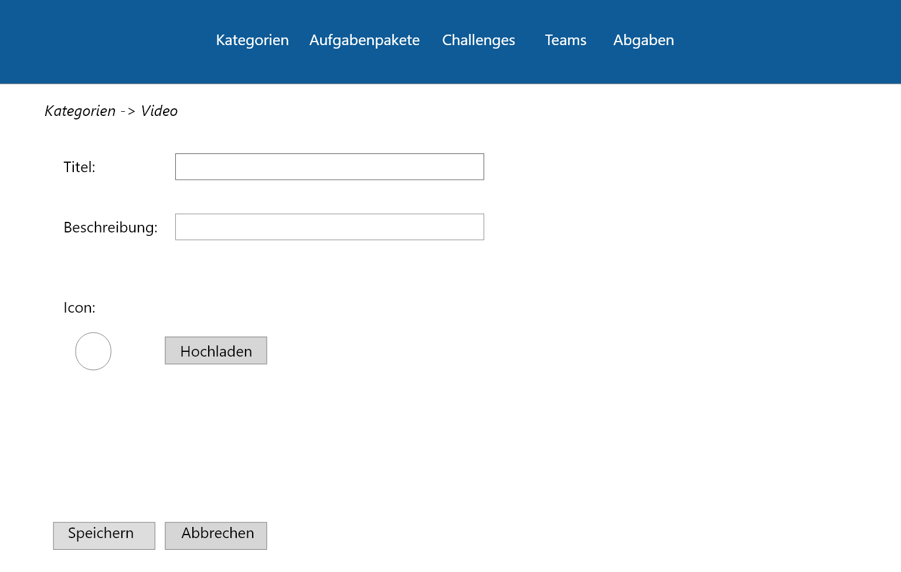

## 2. Aufgabenpakete

**Funktionen:**

Es müssen folgende Funktionen vorhanden sein:
- Übersicht aller Aufgabenpakete
- Bearbeiten der Aufgabenpakete
- Löschen von Aufgabenpaketen
- Erstellen eines neuen Aufgabenpaketes (Kategorie, Name des Aufgabenpaketes, Text der in Beschreibung vorkommt)
- Filtern nach Kategorie (Foto, Video...)
- Live-Suche nach Aufgabenpaket
- Detail Ansicht eines Aufgabenpaketes

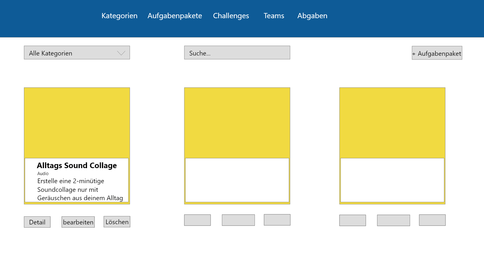

### Neues Aufgabenpaket erstellen:

Es müssen folgende Funktionen vorhanden sein:
- Kategorie auswählen (Drop Down)
- Titel des Aufgabenpaketes angeben
- Beschreibung zum Aufgabenpaket angeben (Einstellungen, Hilfestellungen)
- Beispielbilder/Files hochladen (Video, Audio, Foto...)
- Speichern des Aufgabenpaketes
- Löschen eines Aufgabenpaketes
- **Beim Bearbeiten**:
    - Es werden schon alle Einträge angezeigt inklusive Fotos/Dateien
    - Falls schon eine Datei hochgeladen: Diese muss wieder gelöscht werden können und es soll auch wieder eine neue Datei hinzugefügt werden könnens

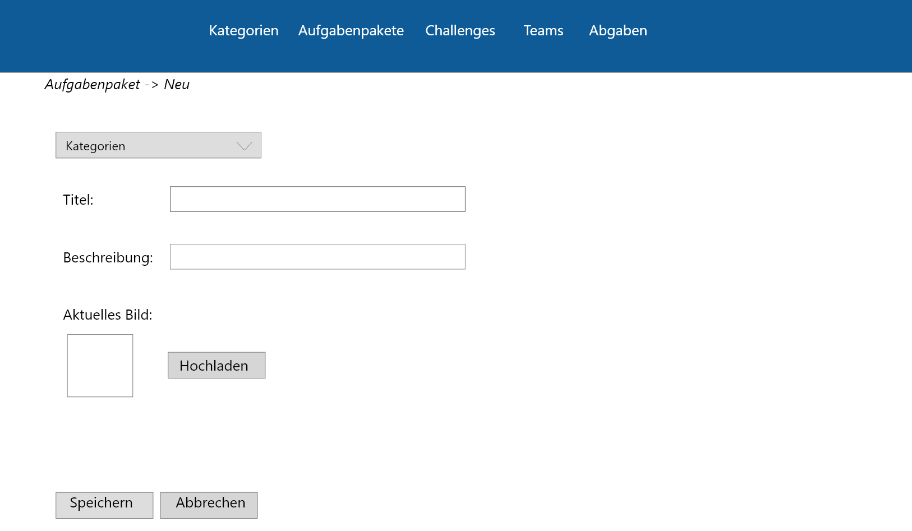

### Aufgabenpakete Details

Es müssen folgende Funktionen vorhanden sein:
- Titel des Aufgabenpaketes soll angezeigt werden oben
- Darunter wird die Beschreibung dargestellt
- Es befinden sich darunter oder rechts daneben die Datein, die der Admin/Lehrer mit hochgeladen hat (Beispielfotos, etc.)
- Wenn man auf Detail Ansicht ist, soll man direkt von da auch die Möglichkeit haben, auf Bearbeiten zu drücken und es dann bearbeiten zu können

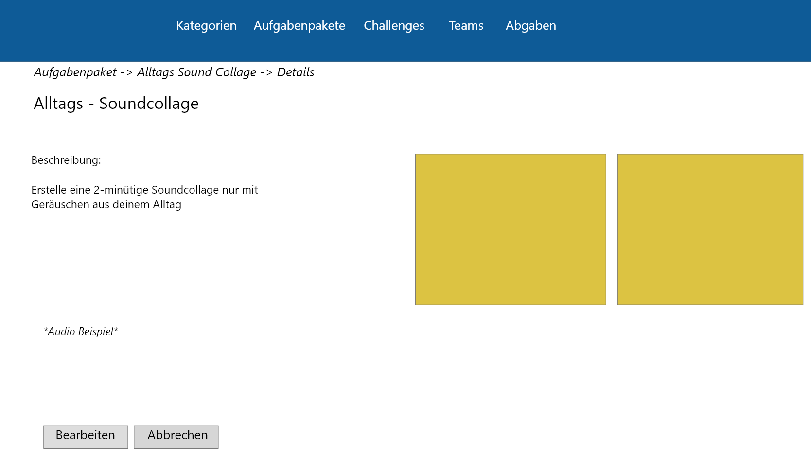

## 3. Teams

**Funktionen:**

Es müssen folgende Funktionen vorhanden sein:
- Teamname soll angezeigt werden
- Schuljahr muss dabei stehen
- Mitgliederanzahl der Teams steht dabei
- Die Mitglieder stehen werden angezeigt
- Detailansicht des Teams (welche Challenges schon erfüllt sind, Abgaben, etc.)
- Bearbeiten eines Teams
- Neues Team erstellen
- Löschen eines Teams
- Live-Suche nach Teams (Teamname, Mitglieder)
- Filtern nach Schuljahr

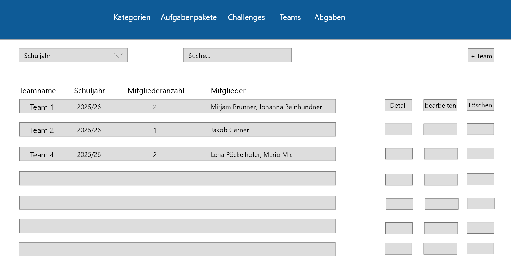

### Neues Team erstellen/bearbeiten

Es müssen folgende Funktionen vorhanden sein:
- Pop Up Fenster
- Team einen Namen geben können
- Nach Schülern Suchen
    - Live-Suche
    - Filtern nach Schuljahr
    - Filtern nach Klassen
    - Es werden verfügbare Schüler angezeigt
- Team Mitglieder auswählen (einzelne Schüler) 
- Speichern eines Teams
- Abbrechen, um Vorgang nicht abzuschließen
- **Bearbeiten:**
    - Es sollen bereits ausgewählte Schüler wieder abgewählt  und neue Schüler ausgewählt werden können

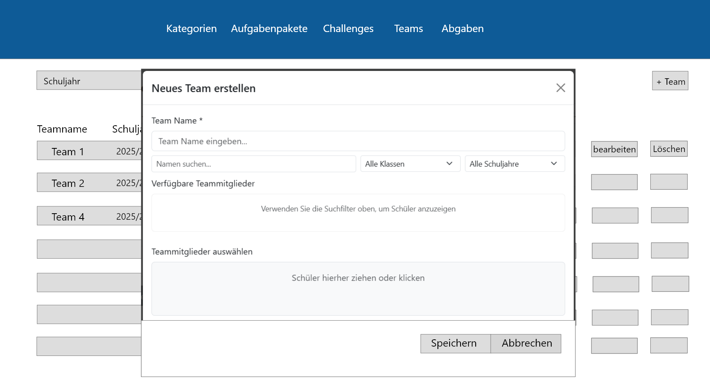

### Teams Detailsansicht

Es müssen folgende Funktionen vorhanden sein:
- Team Details werden angezeigt:.
    - Teamname
    - Teammitglieder
    - (Id? Mitgliederanzahl?,...)
- Zugeiteile Challenges
- Bereits abgegebene Challenges
- Bereits bewertete Challenges
- Bereits abgelehnte Challenges
- Zurück-Button, um Detailansicht zu verlassen

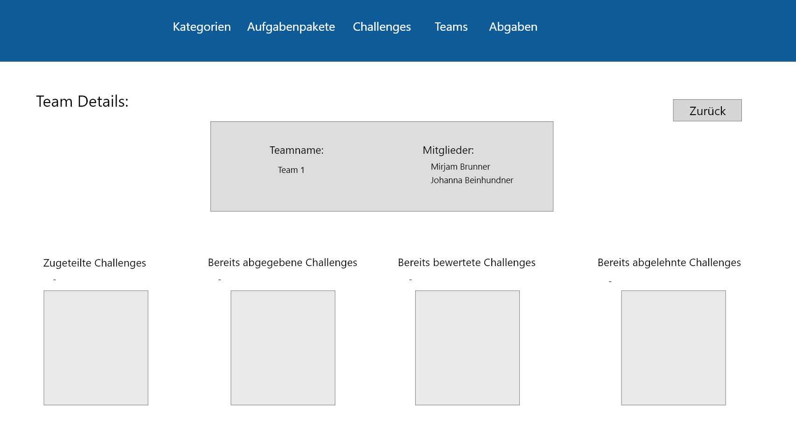

## 4. Challenges

**Funktionen**

Es müssen folgende Funktionen vorhanden sein:
- Alle Chalenges werden angezeigt
- Neue Challenge erstellen
- Challenge bearbeiten
- Challenge löschen
- Filtern nach Kategorien
- Filtern nach Schuljahr
- Live-Suche nach Challenge (Aufgabenpaket, Teamname, Teammitglieder, Kategorie,...)
- Löschen einer Challenge

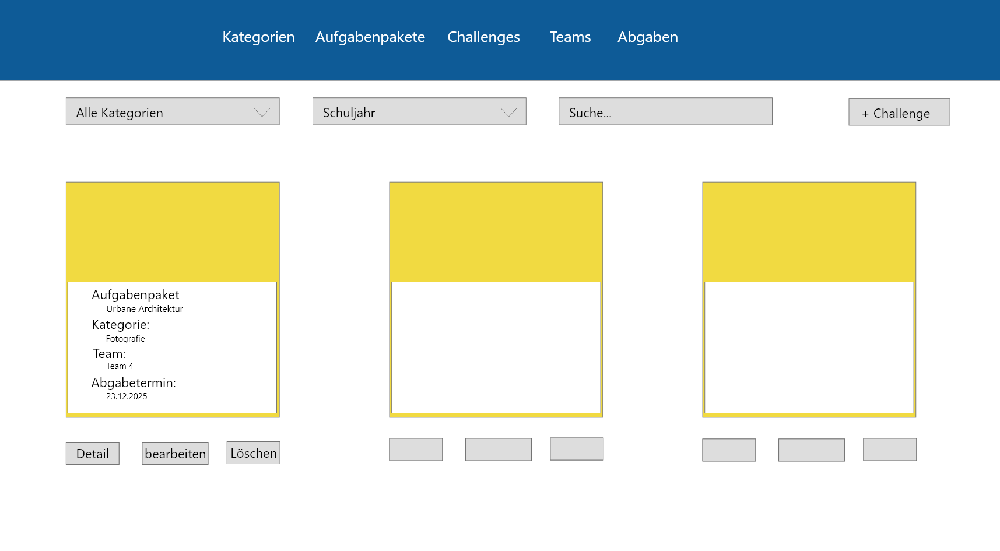

### Neue Challenge erstellen/bearbeiten

Es müssen folgende Funktionen vorhanden sein:
- Aufgabenpaket kann ausgewählt werden
- Schuljahr kann ausgewählt werden (bzw- wird automatisch mitgespeichert)
- Abgabedatum wird angegeben
- Challenge Zusatzinformationen können angegeben werden (Kameraeinstellungen)
- Eventuell Bilder oder Dateien noch mit Hochladen
    - Beliebig viele
- Teams werden der Challenge zugewiesen (Bereits vorhandene Teams)
- Es können direkt dort Teams erstellt werden --> kommt zu Team-erstellen-Pop-Up-Fenster
- Team kann erstellt werden (Button)
- Abbrechen- Button

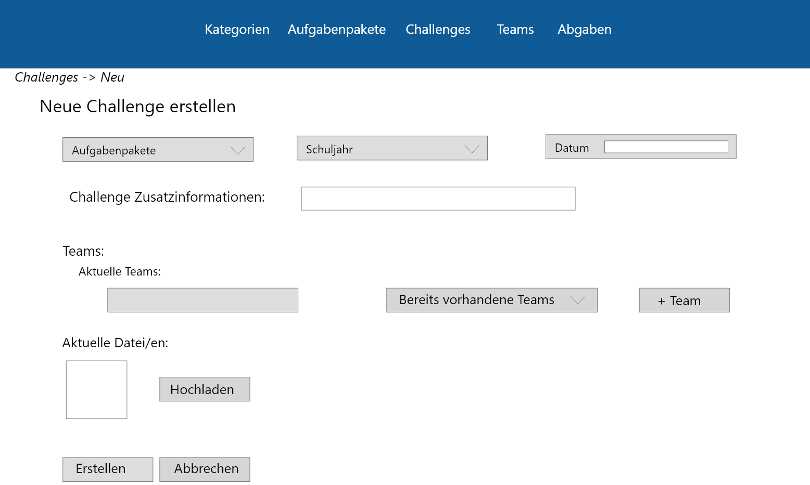

### Challenges Detailansicht

Es müssen folgende Funktionen vorhanden sein/Ansichten:
- Name der Challenges (=Aufgabenpaketname) wird angezeigt
- Abgabedatum wird angezeigt
- Kategorie wird angezeigt
- Schuljahr wird angezeigt
- Beschreibung wird angezeigt
- Teaminformationen werden angezeigt
- Speichern-Button
- Abbrechen-Button
- Beispielfotos/dateien werden angezeigt
- Man kann direkt von dieser Ansicht auf Bearbeiten-Button drücken und Challenge bearbeiten

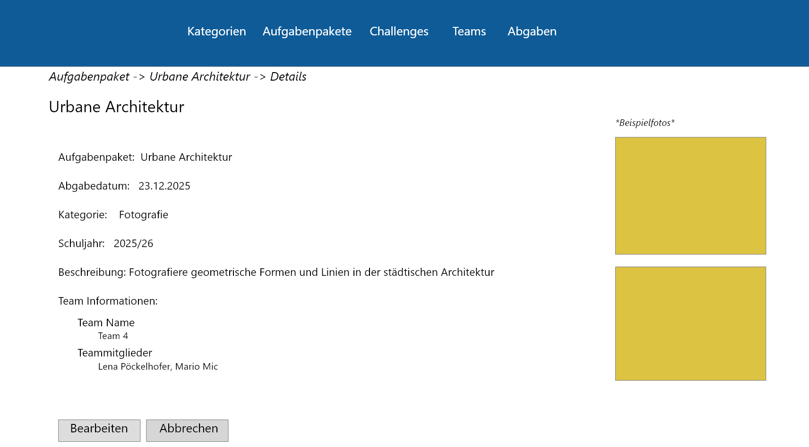

- + **Schüler-Ansicht**

**Funktionen**

Es müssen folgende Funktionen vorhanden sein:
- Challenge von angemeldeten Schüler werden angezeigt, worin er erwähnt worden ist
- Filtern nach Kategorien
- Live Suche nach Challenge (Challengename, Mitgliedername, Beschreibung,...)
- Detailansicht von Challenge 

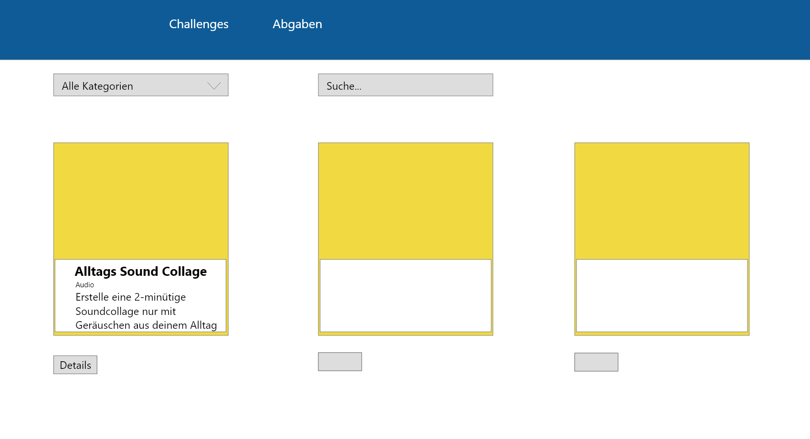

### Schüler - Challenges Detailsansicht

Es müssen folgende Funktionen vorhanden sein:
- Challengename wird angezeigt
- Abgabedatum wird angezeigt
- Kategorie wird angezeigt
- Schuljahr wird angezeigt
- Beschreibung wird angezeigt
- Teaminformationen werden angezeigt (Teamname,-mitglieder)
- Beispieldatein werden angezeigt
- Zurück-button um Ansicht zu verlassen
- Abgabe-einreichen-Button, um als Schüler Datein abzugeben

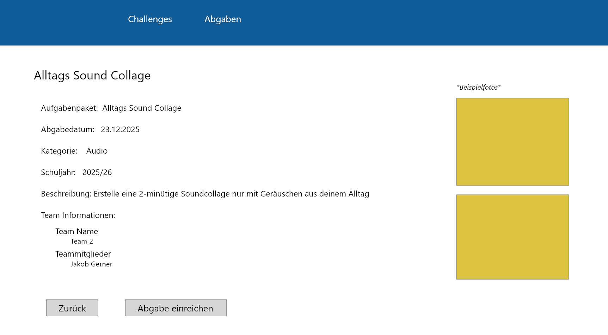

## 5. Abgaben

**Funktionen**

Es müssen folgende Funktionen vorhanden sein:
- Challenge Name wird angezeigt (=Aufgabenpaketname)
- Teamname wird angezeigt (ev. auch Mitglieder)
- Status wird angezeigt (abgegeben, gesehen, bewertet, etc.)
- Einreichungsdatum wird angezeigt
- Bewerten-Button, um Abgabe zu bewerten, falls abgegeben
- Bewertung-ansehen-Button (falls bereits schon bewertet)
- Filtern nach Status
- Live-Suche nach Challenge/Team,...

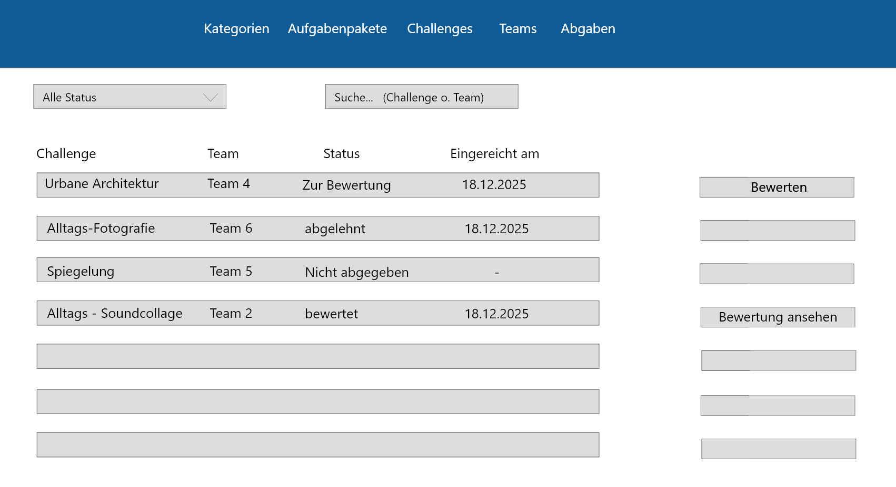

### Abgabe bewerten

Es müssen folgende Funktionen vorhanden sein:
- Name der Challenge wird angezeigt
- Teamname wird angezeigt
- Teammitglieder werden angezeigt
- Status wird angezeigt
- Beschreibung von Teams wird angezeigt (welche sie bei der Abgabe hinzugefügt haben, Zusatz zur Aufgabe)
- Dateien von Teams werden angezeigt --> können von Lehrer/Admin auch geöffnet und heruntergeladen werden
    - PDF, Bilder, Videos, Audios sind möglich
-  Bewertung
    - Punktezahl kann vergeben werden
    - Ein Feedback kann eingetragen werden
    - Bewertung-speichern-Button (Wird an Schüler zurückgegeben)
    - Ablehnen-Button (Abgabe wird abgelehnt --> Schüler bekommt zurück)
- Zurück-zur-Übersicht-Button --> Man kommt wieder zur Abgabenansicht

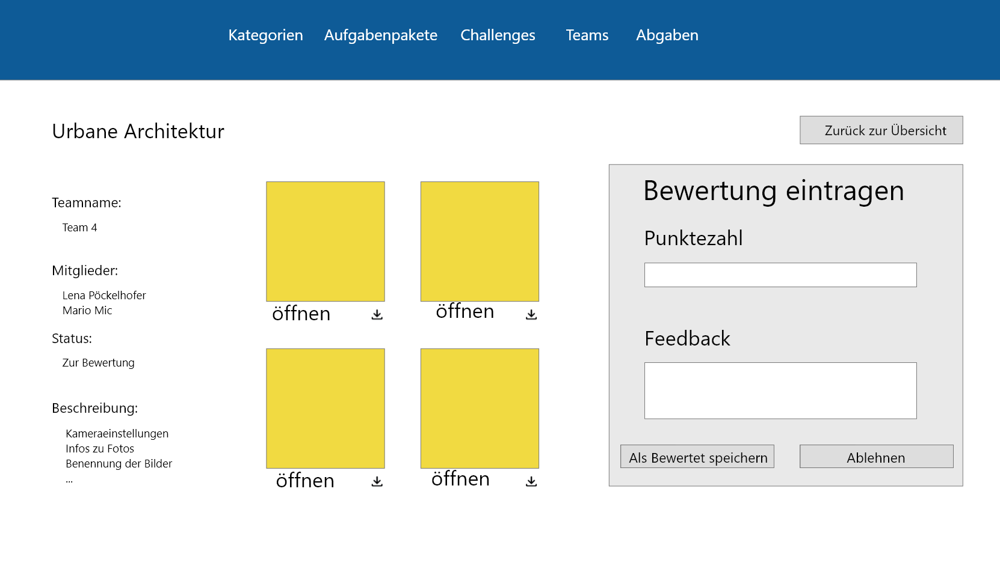

- + **Schüler-Ansicht**

### Schüler - Challenges Abgabe einreichen

Es müssen folgende Funktionen vorhanden sein:
- Dateien können ausgewählt und hochgeladen werden (Pdf, Video, Audio oder Foto)
- Titel der Abgabe kann hinzugefügt werden
- Einstellungen bei der Kamera werden eingegeben (oder von Programm)
- Zusatzinformationen können hinzugefügt werden
- Man sieht seine bereits hochgeladenen Dateien (falls schon welche hochgeladen sind)
- Zurück-Button um Ansicht zu verlassen
- Beitrag-abgeben-Button, um Dateien final abzugeben

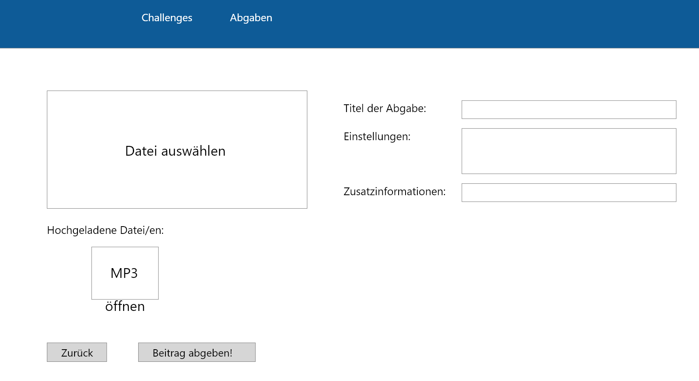

### Schüler - Abgaben (Übersicht)

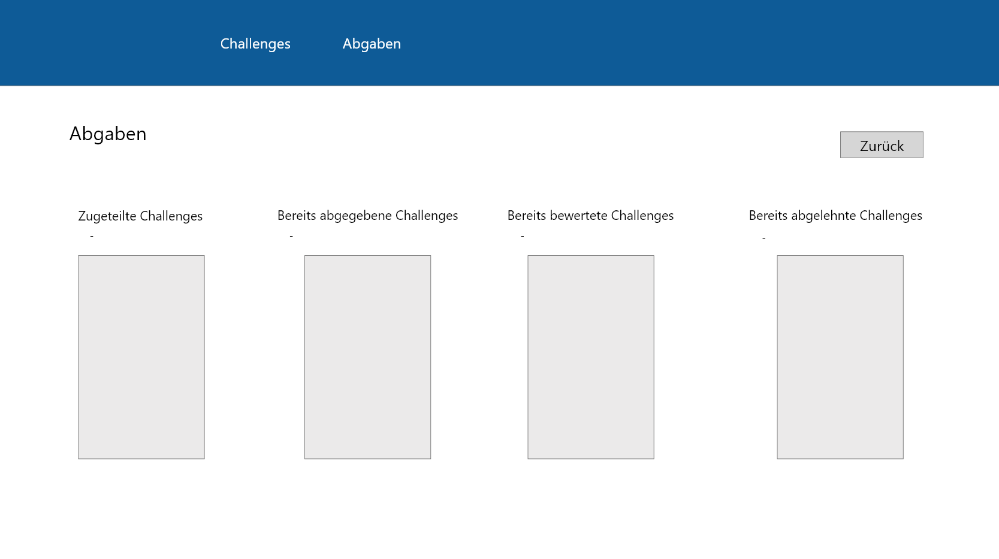