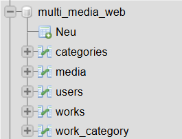

# Datenbank

## Benutzer:
Verschiedene Benutzer haben verschiedene *Rollen*, 
wie zum Beispiel: 
- Administrator 
- Schüler 
- Lehrer

## Medien:
 Alle Benutzer können Werke anlegen. Ein Werk kann aus *mehreren Medien* bestehen. Die Werke lassen sich in Kategorien einteilen, wie zum Beispiel:
- Audio
- Video 
- Fotografie 
- 3D Modellierung
- Metallgestaltung

## Aufbau Datenbank
Um die Medien in verschiedene Werke speichern zu können, legt man eine extra Tabelle an. Zum Beispiel:
- partOf

### Vorgang
Es gibt mehrere Kategorien, wobei es mehrere Werke gibt. In den Werken können mehrere Medien von Usern gespeichert werden. Übersicht: 

- User --> Kategorien --> Werke/Projekte --> Medien

