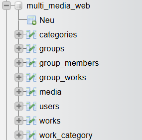
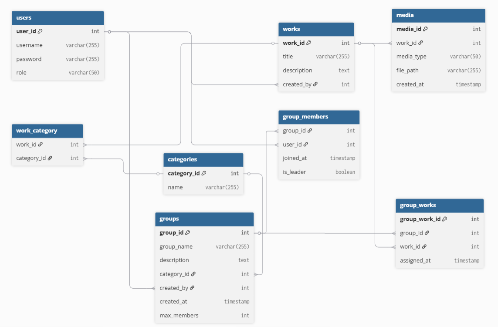

# Datenbank

## Benutzer:
Verschiedene Benutzer haben verschiedene *Rollen*, 
wie zum Beispiel: 
- Administrator 
- Schüler 
- Lehrer


## Medien:
 Alle Benutzer können Werke anlegen. Ein Werk kann aus *mehreren Medien* bestehen. Die Werke lassen sich in Kategorien einteilen, wie zum Beispiel:
- Audio
- Video 
- Fotografie 
- 3D Modellierung
- Metallgestaltung

## Aufbau Datenbank
Um die Medien in verschiedene Werke speichern zu können, legt man eine extra Tabelle an. Zum Beispiel:
- Work_category

## Datenbankerweiterung: Gruppen/Teams
Bei den Kategorien Foto und Video werden Gruppen erstellt. 
Foto:
- max. 3 Teilnehmer
- max. 6 Teilhehmer





### Vorgang
Es gibt mehrere Kategorien, wobei es mehrere Werke gibt. In den Werken können mehrere Medien von Usern gespeichert werden. Übersicht: 

- User: Kategorien --> Werke/Projekte --> Medien


--- 
###  Categories:
In "Categories" werden alle Kategorien angelegt. Es gibt mehrere Kategorien wie zum Beispiel Video, Foto, 3D Modellierung und Audio.

### Works:
In "Works" werden die einzelnen Aufgaben angelegt, die zu erledigen sind. Zum Beispiel bei Foto: 1. Oneshot, 2. Himmel,... 

### Media:
In "Media" werden alle Medien von den Usern angelegt. Es können mehrere Medien in Arbeiten (Works) hochgeladen werden.

### Users:
In "Users" werden alle User angelegt. Darunter zählen Schüler, Lehrer und Admin. User können Medien in Arbeiten hochladen. 

### Work_category
In "Work_category" werden alle Medien und Arbeiten angelegt. Dabei können alle Medien in mehrere Kategorien zugeteilt werden.

### Groups
In "Groups" werden alle Gruppen angezeigt mit den jeweiligen Gruppennamen und der jeweiligen Teilnehmeranzahl.

### Group_members
Unter "Group_members" werden werden die User zu Gruppen zugeteilt. Dies wird durch die User-ID und durch die Gruppen-ID ermöglicht. Dabei wrid immer der erste hinzugefügte Schüler als "Leader" bezeichnet. Er hat die Berechtigung, Fotos, Videos, etc. hochzuladen.

### Group_works
Unter "Group_works" werden die Arbeiten der einzelnen Gruppen gespeichert. 


# Datenbank Befehle: Multi Media Challenge

## 1. Multi_media_web Tabellen

```sql
-- Tabelle erstellen
-- 1. Users Tabelle
CREATE TABLE Users (
    user_id INT PRIMARY KEY AUTO_INCREMENT,
    username VARCHAR(255) NOT NULL,
    password VARCHAR(255) NOT NULL,
    role ENUM('Administrator', 'Schüler', 'Lehrer') NOT NULL
);

-- 2. Categories Tabelle
CREATE TABLE Categories (
    category_id INT PRIMARY KEY AUTO_INCREMENT,
    name VARCHAR(255) NOT NULL
);

-- 3. Works Tabelle
CREATE TABLE Works (
    work_id INT PRIMARY KEY AUTO_INCREMENT,
    title VARCHAR(255) NOT NULL,
    description TEXT,
    created_by INT,
    FOREIGN KEY (created_by) REFERENCES Users(user_id)
);

-- 4. Media Tabelle
CREATE TABLE Media (
    media_id INT PRIMARY KEY AUTO_INCREMENT,
    work_id INT,
    media_type ENUM('Audio', 'Video', 'Foto', 'Animation') NOT NULL,
    file_path VARCHAR(255) NOT NULL,
    created_at TIMESTAMP DEFAULT CURRENT_TIMESTAMP,
    FOREIGN KEY (work_id) REFERENCES Works(work_id)
);

-- 5. Work_Category Tabelle (Many-to-Many zwischen Works und Categories)
CREATE TABLE Work_Category (
    work_id INT,
    category_id INT,
    PRIMARY KEY (work_id, category_id),
    FOREIGN KEY (work_id) REFERENCES Works(work_id),
    FOREIGN KEY (category_id) REFERENCES Categories(category_id)
);

-- 6. Groups Tabelle (NEU)
CREATE TABLE Groups (
    group_id INT PRIMARY KEY AUTO_INCREMENT,
    group_name VARCHAR(255) NOT NULL,
    description TEXT,
    category_id INT,
    created_by INT,
    created_at TIMESTAMP DEFAULT CURRENT_TIMESTAMP,
    max_members INT DEFAULT 3,
    FOREIGN KEY (category_id) REFERENCES Categories(category_id),
    FOREIGN KEY (created_by) REFERENCES Users(user_id)
);

-- 7. Group_Members Tabelle (NEU)
CREATE TABLE Group_Members (
    group_id INT,
    user_id INT,
    joined_at TIMESTAMP DEFAULT CURRENT_TIMESTAMP,
    is_leader BOOLEAN DEFAULT FALSE,
    PRIMARY KEY (group_id, user_id),
    FOREIGN KEY (group_id) REFERENCES Groups(group_id),
    FOREIGN KEY (user_id) REFERENCES Users(user_id)
);

-- 8. Group_Works Tabelle (NEU)
CREATE TABLE Group_Works (
    group_work_id INT PRIMARY KEY AUTO_INCREMENT,
    group_id INT,
    work_id INT,
    assigned_at TIMESTAMP DEFAULT CURRENT_TIMESTAMP,
    FOREIGN KEY (group_id) REFERENCES Groups(group_id),
    FOREIGN KEY (work_id) REFERENCES Works(work_id)
);
```

```sql
-- Löschen einer Tabelle
DROP TABLE users;
``` 
```sql
-- Einträge in Tabelle
-- 1. Zuerst Users (wegen FOREIGN KEY Constraints)
INSERT INTO Users (username, password, role) VALUES
('admin1', 'password123', 'Administrator'),
('schueler1', 'password123', 'Schüler'),
('lehrer1', 'password123', 'Lehrer'),
('admin2', 'adminpassword', 'Administrator'),
('schueler2', 'pass1234', 'Schüler'),
('lehrer2', 'securepassword', 'Lehrer'),
('schueler3', 'testpassword', 'Schüler');

-- 2. Dann Categories
INSERT INTO Categories (name) VALUES
('Audio'),
('Video'),
('Fotografie'),
('Dokumente'),
('Illustrationen');

-- 3. Dann Works (benötigt Users)
INSERT INTO Works (title, description, created_by) VALUES
('Werk 1', 'Beschreibung von Werk 1', 1),
('Werk 2', 'Beschreibung von Werk 2', 2),
('Werk 3', 'Beschreibung von Werk 3', 3),
('Werk 4', 'Beschreibung von Werk 4', 4),
('Werk 5', 'Beschreibung von Werk 5', 5),
('Werk 6', 'Beschreibung von Werk 6', 6),
('Werk 7', 'Beschreibung von Werk 7', 7);

-- 4. Dann Media (benötigt Works)
INSERT INTO Media (work_id, media_type, file_path) VALUES
(1, 'Audio', '/path/to/audio1.mp3'),
(1, 'Video', '/path/to/video1.mp4'),
(2, 'Foto', '/path/to/photo1.jpg'),
(2, 'Audio', '/path/to/audio2.mp3'),
(3, 'Video', '/path/to/video2.mp4'),
(3, 'Foto', '/path/to/photo2.jpg'),
(4, 'Audio', '/path/to/audio3.mp3'),
(5, 'Foto', '/path/to/photo3.jpg'),
(6, 'Video', '/path/to/video3.mp4'),
(7, 'Audio', '/path/to/audio4.mp3');

-- 5. Dann Work_Category (benötigt Works und Categories) - KORRIGIERT
INSERT INTO Work_Category (work_id, category_id) VALUES
(1, 1), (1, 2), (2, 3), (2, 1), (3, 2), (3, 3),
(4, 1), (5, 3), (6, 2), (7, 1);


-- Groups Tabelle befüllen
INSERT INTO Groups (group_name, description, category_id, created_by, max_members) VALUES
('Foto-Team Alpha', 'Gruppe für Fotografie-Projekte', 3, 3, 3),
('Audio-Produzenten', 'Gruppe für Audio-Aufnahmen', 1, 6, 2),
('Video-Crew', 'Gruppe für Video-Produktion', 2, 3, 3),
('Kreative Köpfe', 'Allrounder-Gruppe für verschiedene Medien', 4, 2, 3);

-- Group_Members Tabelle befüllen (Wer ist in welcher Gruppe)
INSERT INTO Group_Members (group_id, user_id, is_leader) VALUES
-- Foto-Team Alpha (Gruppe 1)
(1, 2, TRUE),   -- schueler1 ist Leader
(1, 5, FALSE),  -- schueler2 ist Mitglied
(1, 7, FALSE),  -- schueler3 ist Mitglied

-- Audio-Produzenten (Gruppe 2)
(2, 5, TRUE),   -- schueler2 ist Leader
(2, 2, FALSE),  -- schueler1 ist Mitglied

-- Video-Crew (Gruppe 3)
(3, 7, TRUE),   -- schueler3 ist Leader
(3, 5, FALSE),  -- schueler2 ist Mitglied

-- Kreative Köpfe (Gruppe 4)
(4, 2, TRUE),   -- schueler1 ist Leader
(4, 7, FALSE);  -- schueler3 ist Mitglied

-- Group_Works Tabelle befüllen (Welche Werke gehören zu welcher Gruppe)
INSERT INTO Group_Works (group_id, work_id) VALUES
-- Foto-Team Alpha arbeitet an diesen Werken
(1, 2),  -- Werk 2 (schueler1 - Fotos)
(1, 5),  -- Werk 5 (schueler2 - Fotos)

-- Audio-Produzenten arbeiten an diesen Werken
(2, 4),  -- Werk 4 (admin2 - Audio)
(2, 7),  -- Werk 7 (schueler3 - Audio)

-- Video-Crew arbeitet an diesen Werken
(3, 6),  -- Werk 6 (lehrer2 - Video)

-- Kreative Köpfe arbeiten an diesen Werken
(4, 2),  -- Werk 2 (schueler1 - Fotos)
(4, 7);  -- Werk 7 (schueler3 - Audio)
```


```sql
-- Einträge von Tabellen löschen
-- FOREIGN KEY Constraints deaktivieren
SET FOREIGN_KEY_CHECKS = 0;

-- Mit DELETE leeren (langsamer aber sicher)
DELETE FROM group_works;
DELETE FROM group_members;
DELETE FROM groups;
DELETE FROM media;
DELETE FROM work_category;
DELETE FROM works;
DELETE FROM categories;
DELETE FROM users;

-- AUTO_INCREMENT zurücksetzen
ALTER TABLE group_works AUTO_INCREMENT = 1;
ALTER TABLE group_members AUTO_INCREMENT = 1;
ALTER TABLE groups AUTO_INCREMENT = 1;
ALTER TABLE media AUTO_INCREMENT = 1;
ALTER TABLE work_category AUTO_INCREMENT = 1;
ALTER TABLE works AUTO_INCREMENT = 1;
ALTER TABLE categories AUTO_INCREMENT = 1;
ALTER TABLE users AUTO_INCREMENT = 1;

-- FOREIGN KEY Constraints wieder aktivieren
SET FOREIGN_KEY_CHECKS = 1;
```

```sql
-- Korrigierte Daten einfügen (Lehrer, Admin nicht in Gruppen vorhanden)
-- 1. Users
INSERT INTO Users (username, password, role) VALUES
('admin1', 'password123', 'Administrator'),
('schueler1', 'password123', 'Schüler'),
('lehrer1', 'password123', 'Lehrer'),
('admin2', 'adminpassword', 'Administrator'),
('schueler2', 'pass1234', 'Schüler'),
('lehrer2', 'securepassword', 'Lehrer'),
('schueler3', 'testpassword', 'Schüler');

-- 2. Categories
INSERT INTO Categories (name) VALUES
('Audio'),
('Video'),
('Fotografie'),
('Dokumente'),
('Illustrationen');

-- 3. Works (NUR von Schülern!)
INSERT INTO Works (title, description, created_by) VALUES
('Mein Foto Projekt', 'Beschreibung von Foto Projekt', 2),  -- schueler1
('Audio Aufnahme', 'Beschreibung von Audio', 5),            -- schueler2
('Video Produktion', 'Beschreibung von Video', 7),          -- schueler3
('Natur Fotografie', 'Beschreibung von Natur Fotos', 2),    -- schueler1
('Podcast Folge', 'Beschreibung von Podcast', 5),           -- schueler2
('Animation Video', 'Beschreibung von Animation', 7);       -- schueler3

-- 4. Media (NUR für Schüler-Works)
INSERT INTO Media (work_id, media_type, file_path) VALUES
(1, 'Foto', '/path/to/photo1.jpg'),
(1, 'Foto', '/path/to/photo2.jpg'),
(2, 'Audio', '/path/to/audio1.mp3'),
(3, 'Video', '/path/to/video1.mp4'),
(4, 'Foto', '/path/to/photo3.jpg'),
(5, 'Audio', '/path/to/audio2.mp3'),
(6, 'Video', '/path/to/video2.mp4'),
(6, 'Animation', '/path/to/animation1.gif');

-- 5. Work_Category
INSERT INTO Work_Category (work_id, category_id) VALUES
(1, 3), (1, 4),    -- Werk 1: Fotografie, Dokumente
(2, 1), (2, 4),    -- Werk 2: Audio, Dokumente  
(3, 2), (3, 5),    -- Werk 3: Video, Illustrationen
(4, 3),            -- Werk 4: Fotografie
(5, 1),            -- Werk 5: Audio
(6, 2), (6, 5);    -- Werk 6: Video, Illustrationen

-- 6. Groups (NUR von Schülern erstellt)
INSERT INTO Groups (group_name, description, category_id, created_by, max_members) VALUES
('Foto-Team Alpha', 'Gruppe für Fotografie-Projekte', 3, 2, 3),      -- schueler1
('Audio-Produzenten', 'Gruppe für Audio-Aufnahmen', 1, 5, 2),        -- schueler2
('Video-Crew', 'Gruppe für Video-Produktion', 2, 7, 3);              -- schueler3

-- 7. Group_Members (NUR Schüler)
INSERT INTO Group_Members (group_id, user_id, is_leader) VALUES
(1, 2, TRUE), (1, 5, FALSE),   -- Foto-Team: schueler1 (Leader), schueler2
(2, 5, TRUE), (2, 7, FALSE),   -- Audio-Produzenten: schueler2 (Leader), schueler3
(3, 7, TRUE), (3, 2, FALSE);   -- Video-Crew: schueler3 (Leader), schueler1

-- 8. Group_Works
INSERT INTO Group_Works (group_id, work_id) VALUES
(1, 1), (1, 4),   -- Foto-Team arbeitet an Werk 1 & 4
(2, 2), (2, 5),   -- Audio-Produzenten arbeitet an Werk 2 & 5
(3, 3), (3, 6);   -- Video-Crew arbeitet an Werk 3 & 6
```

## Beispielhafte Befehle:
### SELECT
Wähle User mit der ID 1 aus.
```sql
SELECT username FROM `users` WHERE user_id=1;
```

Finde alle Schüler in der User-Tabelle und zeige ihre ID's und Usernamen.
```sql
SELECT username,user_id FROM `users` WHERE role='Schüler';
```
Zeige ein Werk eines bestimmten Schülers:
```sql
SELECT 
    w.work_id,
    w.title,
    w.description,
    u.username
FROM Works w
JOIN Users u ON w.created_by = u.user_id
WHERE u.username = 'schueler1';
```
Zeige Werke aller Schüler:
```sql
SELECT 
    w.work_id,
    w.title,
    w.description,
    u.username
FROM Works w
JOIN Users u ON w.created_by = u.user_id
WHERE u.role = 'Schüler';
```
Zeige alle Schüler an, die Fotos hochgeladen haben:
```sql
SELECT DISTINCT
    u.username,
    u.role
FROM Users u
JOIN Works w ON u.user_id = w.created_by
JOIN Media m ON w.work_id = m.work_id
WHERE u.role = 'Schüler'
AND m.media_type = 'Foto';
```
### SELECT - GRUPPEN
Zeige alle Gruppen mit ihren Mitgliedern.
```sql
SELECT 
    g.group_name,
    g.description,
    c.name as kategorie,
    u.username as gruppengründer,
    COUNT(gm.user_id) as mitglieder_anzahl
FROM Groups g
JOIN Categories c ON g.category_id = c.category_id
JOIN Users u ON g.created_by = u.user_id
LEFT JOIN Group_Members gm ON g.group_id = gm.group_id
GROUP BY g.group_id;
```

Zeige detaillierte Mitgliederliste aller Gruppen.
```sql
SELECT 
    g.group_name,
    u.username,
    u.role,
    CASE 
        WHEN gm.is_leader = 1 THEN 'Leader'
        ELSE 'Mitglied'
    END as rolle
FROM Groups g
JOIN Group_Members gm ON g.group_id = gm.group_id
JOIN Users u ON gm.user_id = u.user_id
ORDER BY g.group_name, gm.is_leader DESC;
```

Zeige welche Werke zu welchen Gruppen gehören.
```sql
SELECT 
    g.group_name,
    w.title as werk_titel,
    u.username as werk_ersteller,
    m.media_type
FROM Groups g
JOIN Group_Works gw ON g.group_id = gw.group_id
JOIN Works w ON gw.work_id = w.work_id
JOIN Users u ON w.created_by = u.user_id
LEFT JOIN Media m ON w.work_id = m.work_id
GROUP BY g.group_id, w.work_id;
```

Zeige alle Gruppen eines bestimmten Schülers.
```sql
SELECT 
    g.group_name,
    g.description,
    c.name as kategorie,
    CASE 
        WHEN gm.is_leader = 1 THEN 'Leader'
        ELSE 'Mitglied'
    END as rolle
FROM Groups g
JOIN Group_Members gm ON g.group_id = gm.group_id
JOIN Categories c ON g.category_id = c.category_id
WHERE gm.user_id = 2;  -- Für schueler1
```

### UPDATE

Ändere den Titel von einem bestimmten Werk.
```sql
UPDATE Works 
SET title = 'Neuer Titel Name' 
WHERE work_id = 2;
```

Ändere den Titel eines Werks basierend auf Schüler-Username.
```sql
UPDATE Works 
SET title = 'Neuer Titel für Schüler1' 
WHERE created_by = (SELECT user_id FROM Users WHERE username = 'schueler1')
AND work_id = 2;
```

Ändere den Titel und Beschreibung eines Werks.
```sql
UPDATE Works 
SET title = 'Aktualisierter Titel', 
    description = 'Neue Beschreibung des Werks' 
WHERE work_id = 5;
```

Ändere den Medientyp basierend auf die Medien-ID. 
```sql
UPDATE media SET media_type='Audio' WHERE media_id=1;
```

Ändere den Pfad von einer bestimmten Datei.
```sql
UPDATE media SET file_path='/path/to/animation1.zip' WHERE media_id=1;
```

### ALTER
Ändere die Tabellenstruktur von der Tabelle Media und füge zusätzlich Animation zu Foto, Video und Audio hinzu.
```sql
ALTER TABLE media MODIFY COLUMN media_type ENUM('Audio', 'Video', 'Foto', 'Animation') NOT NULL;
```


### INSERT 
Füge einen neuen Schüler mit dem Usernamen "schueler15" und Passwort "123456" hinzu und.

```sql
INSERT INTO users (username,password,role) VALUES ('schueler15','123456','Schüler');
```


